# Первый запуск нового MikroTik: базовый hardening


Привезли новый MikroTik на объект. Воткнули в розетку, подключились WinBox по MAC - и в этот момент устройство уже потенциально торчит в публичную сеть с дефолтными кредами, всеми открытыми сервисами и таймзоной UTC. Эта лаба - чеклист первых 15 минут, после которых роутер можно оставить онлайн.

Цель - не сделать защищённое устройство целиком (для этого нужны firewall, backup, мониторинг), а закрыть самые громкие дыры: дефолтные учётки, открытые сервисы, стандартные порты, отсутствие синхронизации времени.

---

## Модель угроз

```
Что атакует новый MikroTik в интернете в первые часы:

1. Сканеры дефолтных кредов
   admin / (пустой пароль) - заводская комбинация на старых RouterOS
   admin / admin - типовой "слабый" пароль
   Боты находят роутер через Shodan/Censys/массовое сканирование
   за минуты после появления публичного IP

2. CVE-эксплойты под старые версии RouterOS
   Winbox CVE-2018-14847 (Chimay-Red) - читал NDB-файл с паролями
   через 8291/tcp без аутентификации.
   Закрытые порты по умолчанию = меньше attack surface
   даже при наличии уязвимости.

3. Ботнеты под MikroTik
   Mēris (2021) - крупнейший на тот момент DDoS-ботнет на роутерах
   Glupteba, VPNFilter - заражали через комбинацию слабых паролей
   и устаревших версий.
   Роутер становится зомби, через него идёт DDoS, кража трафика,
   крипто-майнинг или прокси для атак.

4. DNS amplification
   /ip dns с allow-remote-requests=yes без firewall input на 53/udp
   превращает роутер в open resolver.
   Используется в усилении DDoS-атак (factor 50x+).
   Через пару дней провайдер пришлёт abuse-уведомление.

Большинство этого закрывается базовой гигиеной из этой лабы.
```

---

## Порядок действий и почему он именно такой

```
1. Identity (имя) - чтобы не путать с другими, безопасности не влияет
2. Создать своего пользователя ДО любых действий с admin
3. Войти под собой и проверить что всё работает
4. Только теперь - сменить пароль admin или отключить его
5. Отключить ненужные сервисы (telnet, ftp, www, api...)
6. Сменить порты SSH и WinBox на нестандартные
7. Часовой пояс
8. NTP-клиент (после смены порта - чтобы логи синхронизации
   шли уже с правильным именем устройства)
9. DNS resolver
10. Firewall input drop на 53/udp с WAN (КРИТИЧНО)
11. Логирование

Главное правило: не отключать admin, пока не убедился что
зашёл под своей учёткой. Иначе - reset через RouterBOOT
и заново всё с консоли.
```

---

## 1. Identity - имя устройства

CLI:
```
/system identity set name=BR1-GW
```

WinBox: `System -> Identity`

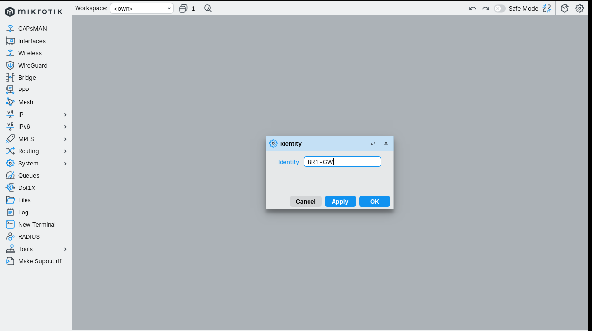

`BR1-GW` - читается как Branch 1 Gateway. Конвенция своя, но осмысленная: при наличии 10+ роутеров в инфраструктуре путаница с дефолтным `MikroTik` - источник аварий ("какой именно из десяти я сейчас перезагружаю?").

Identity также видна в Neighbor Discovery (CDP/MNDP/LLDP) - соседи по сети узнают это имя, и для безопасности на WAN-интерфейсе Neighbor Discovery вообще стоит отключить (отдельная тема).

---

## 2. Создаём своего пользователя ДО отключения admin

CLI:
```
/user add name=mn group=full password=ЕщёСложней456@
```

WinBox: `System -> Users` -> кнопка `+` (Add)

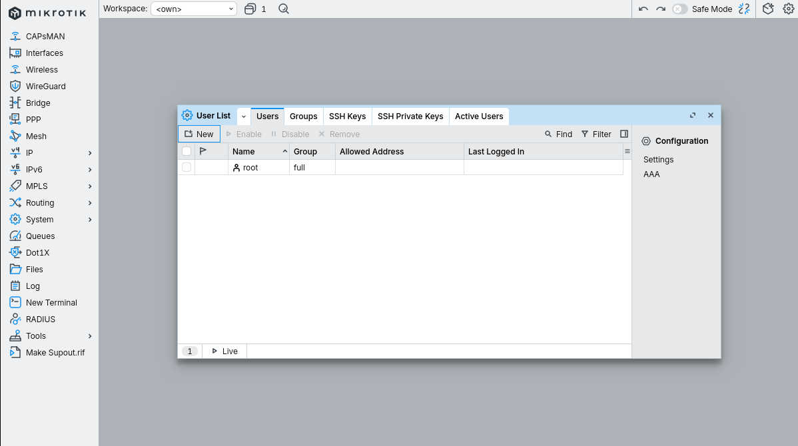

В дефолтном состоянии видно `admin` группы `full`. `root` в современных версиях RouterOS отсутствует - если он у тебя есть, это либо очень старая прошивка, либо чужая конфигурация.

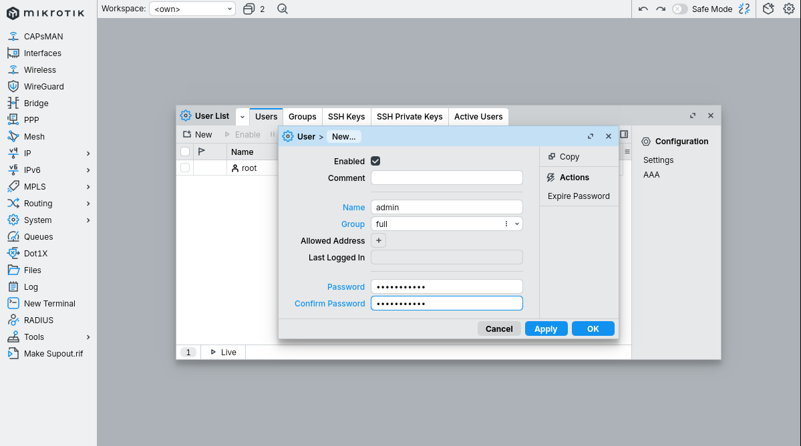

```
Группы прав в RouterOS:
  full   - всё, включая управление пользователями и системой
  write  - можно менять конфиг, но не пользователей и system reset
  read   - только просмотр
  custom - можно собрать свой набор политик

Для админа объекта - full. Для NOC/мониторинга - read.
Для скриптов и автоматизации - write или custom с минимальными правами.
```

---

## 3. Логин под своей учёткой - проверка

CLI: переподключиться по SSH под `admin`.

WinBox: закрыть текущую сессию, открыть новую под `admin`.

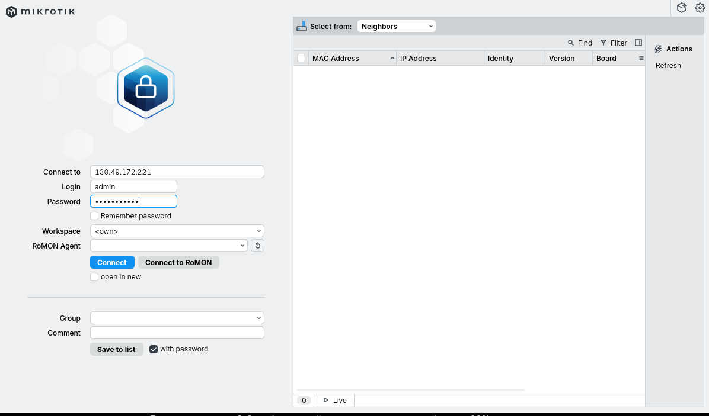

Если ты опечатался при создании пароля или промахнулся с группой - текущая сессия `root` ещё активна и спасёт. Если же сразу отключить root и обнаружить что admin не пускает - дальше только хард-ресет.

---

## 4. Меняем пароль admin (страховка) и отключаем его

Сначала на всякий случай ставим adminу нормальный пароль (если планируем не disable, а оставить как резерв):

CLI:
```
/user set admin password=СложныйПароль123!
```

WinBox: `System -> Users` -> двойной клик по admin -> кнопка `Password...`

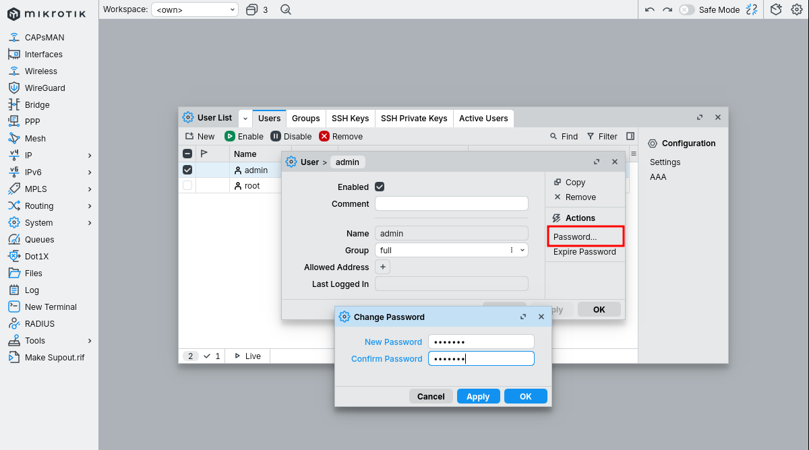

Затем отключаем admin (не удаляем!):

CLI:
```
/user disable admin
```

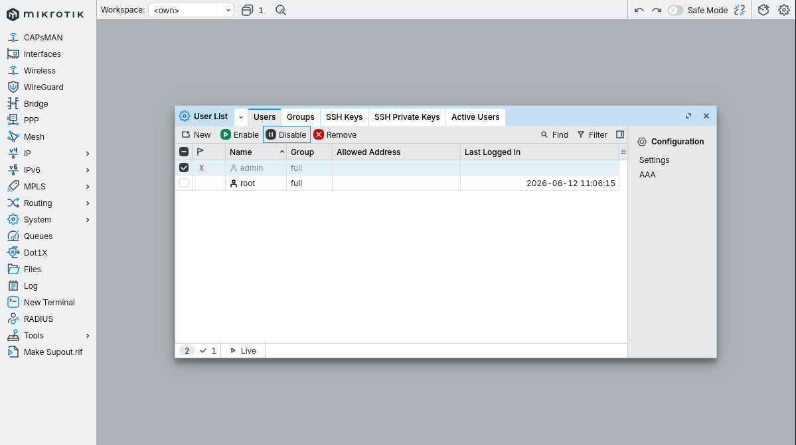

Почему `disable`, а не `remove`:
- Disabled-пользователь не может войти, но конфигурация юзера сохраняется
- При восстановлении из бэкапа или миграции - сразу видно структуру прав
- Если экстренно понадобится - `/user enable admin` и зашёл
- Удалить можно, но это ничего не даёт безопасности (главное чтобы он не пускал) и теряет историю

---

## 5. Отключаем ненужные сервисы

CLI:
```
/ip service set telnet  disabled=yes
/ip service set ftp     disabled=yes
/ip service set api     disabled=yes
/ip service set api-ssl disabled=yes
/ip service set www     disabled=yes
/ip service set www-ssl disabled=yes
```

WinBox: `IP -> Services`

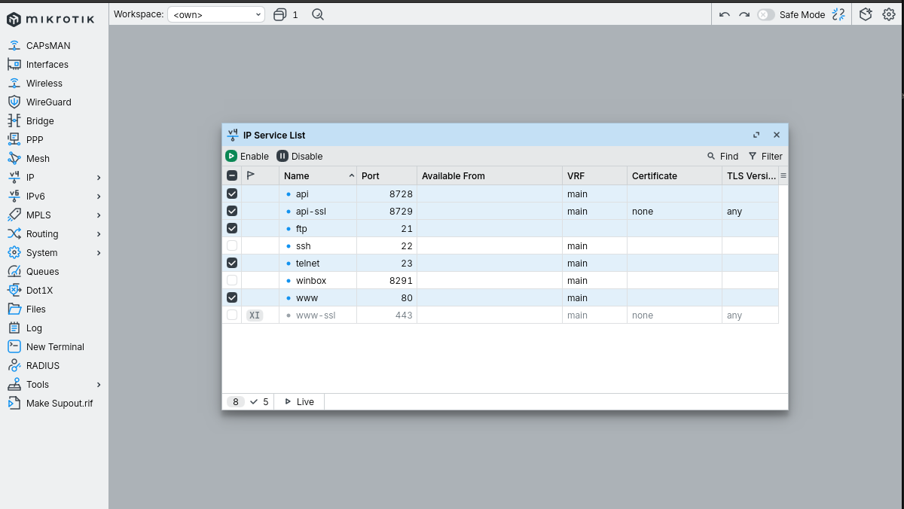
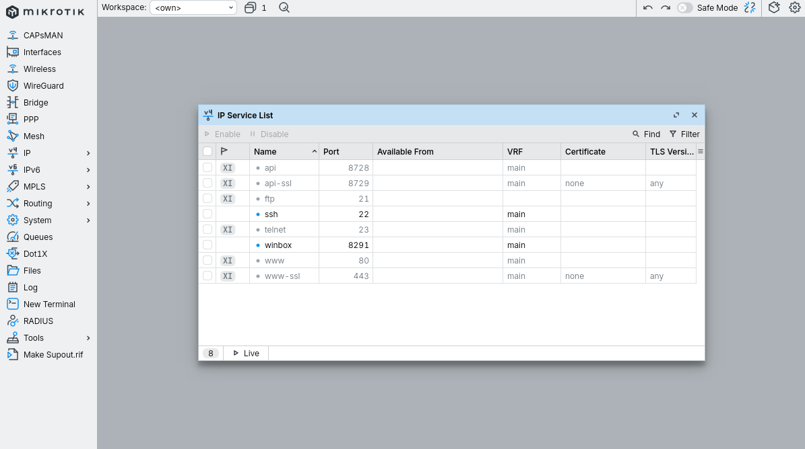

```
Что и почему выключаем:

telnet (23/tcp)    - открытый текст, креды по сети открытым видом.
                     Никогда. Под любым предлогом.

ftp (21/tcp)       - встроенный FTP-сервер MikroTik для заливки файлов.
                     Тоже открытый текст. Файлы льём через SFTP по SSH
                     или через WinBox drag&drop.

api (8728/tcp)     - бинарный API, использовали скрипты и панели.
                     Без TLS, требует включения только если есть конкретный
                     потребитель.

api-ssl (8729/tcp) - то же, но TLS. Включать если ты точно знаешь зачем.

www (80/tcp)       - WebFig HTTP. По HTTP пароль уходит открыто (если
                     попадёт в MITM). Дублирует WinBox функционально.

www-ssl (443/tcp)  - WebFig HTTPS. Если очень нужен веб-доступ - оставить
                     только его, на нестандартном порту, с сертификатом
                     и Available From-ограничением. Иначе - выключить.
```

Оставляем включёнными только `ssh` и `winbox` - и сразу меняем им порты.

---

## 6. Меняем порты SSH и WinBox

CLI:
```
/ip service set ssh    port=22022
/ip service set winbox port=18291
```

WinBox: `IP -> Services` -> двойной клик по сервису -> поле `Port`.

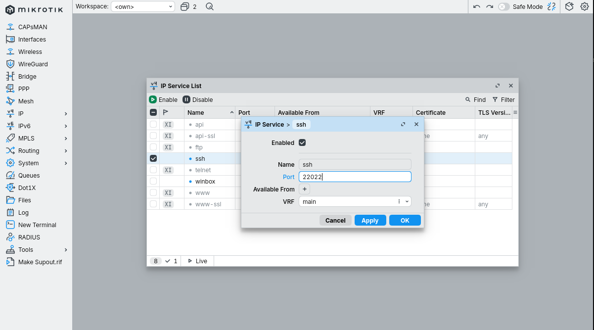
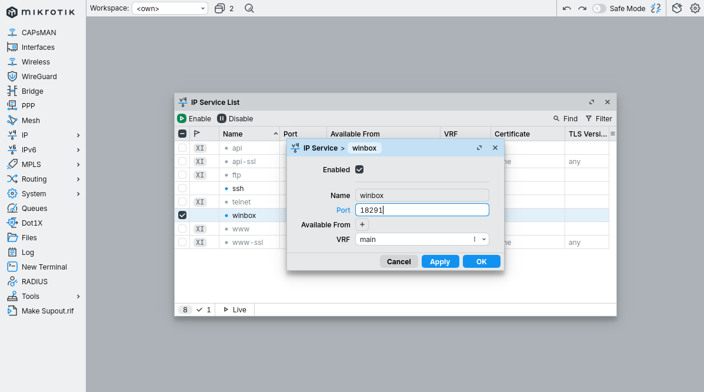
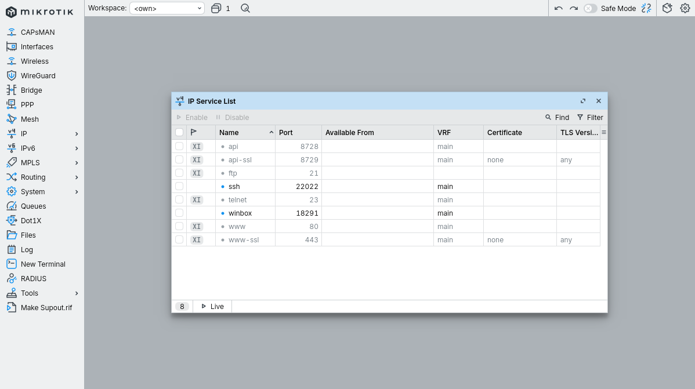

Смена порта - это **не security**, это **гигиена**. Реальную защиту даёт сильный пароль и Available From-список. Но смена убирает 95% автоматических ботов, которые долбят по 22/8291 - в логах становится чище, отчётливо видны целевые сканирования.

```
Выбор портов:
  Избегай "красивых" 2222, 8222, 8222 - сканеры по ним тоже ходят
  Возьми что-то в диапазоне 10000-65000, не дефолтное
  Запиши в свою заметку - роутер ты потом будешь искать
    "почему не пускает на 8291" через год

Важно: новый порт работает СРАЗУ после Apply.
Текущая WinBox-сессия не отвалится, но при следующем входе
указывай адрес как  IP:18291  (или  [IPv6]:18291  для v6).
```

---

## 7. Часовой пояс

CLI:
```
/system clock set time-zone-name=Europe/Moscow
```

WinBox: `System -> Clock` -> вкладка `Time` -> поле `Time Zone Name`.

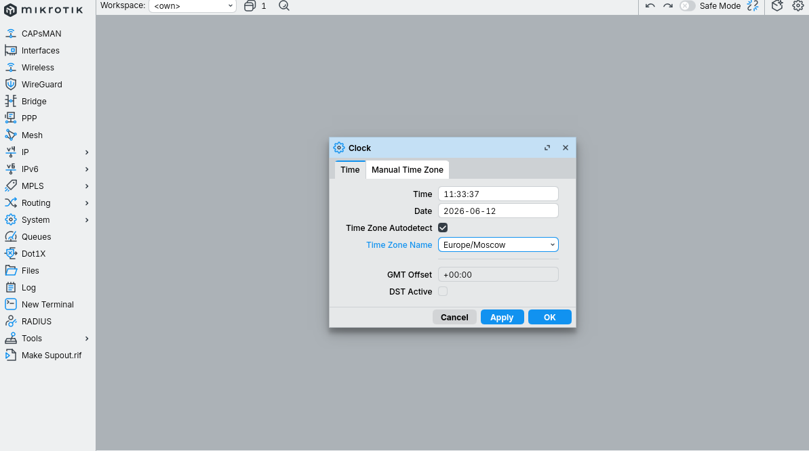

На скрине видно `GMT Offset: +00:00` - это нормальное состояние сразу после Apply, до того как роутер успел подтянуть данные таймзон. После того как клиент NTP синхронизируется и роутер обновит свои внутренние часы, поле станет `+03:00`. Москва не использует DST с 2014 года, поэтому `DST Active: false` - тоже корректно.

Зачем правильное время:
- Логи без таймстампа бесполезны при расследовании инцидентов
- Сертификаты (TLS, IPsec, RouterOS update verification) проверяются по времени - если оно врёт на годы, ничего не работает
- Корреляция событий между роутерами в распределённой инфраструктуре

---

## 8. NTP-клиент

CLI:
```
/system ntp client set enabled=yes servers=ntp1.stratum1.ru,ntp2.stratum1.ru
```

WinBox: `System -> NTP Client`

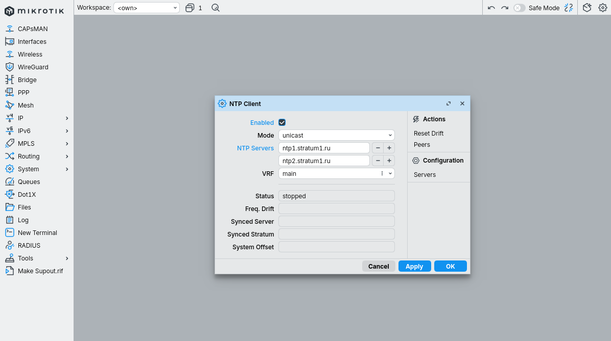

```
NTP serverы по приоритету:

  Свой NTP в инфраструктуре  - идеал, если есть
  ntp1.stratum1.ru / ntp2.stratum1.ru  - российские stratum-1
  pool.ntp.org                 - публичный пул, не stratum-1 но норм
  time.cloudflare.com          - международно, по anycast быстро
  time.windows.com / time.apple.com  - тоже работают

Используй два-три источника. Если один умрёт, NTP сам переключится.
```

На скрине `Status: stopped` - сразу после Apply клиент не успел стартовать. Через 10-30 секунд должен стать `synchronized`. Если остался `stopped`:

```
Диагностика "не синхронизируется":

1. DNS работает?
   /ping ntp1.stratum1.ru
   Если "could not resolve" - сначала настрой DNS (шаг 9).

2. Маршрут наружу есть?
   /ping 8.8.8.8
   Нет - проблема в default route или WAN-интерфейсе.

3. UDP/123 не блокируется?
   Иногда корпоративный фильтр режет NTP.
   Тогда используй внутренний NTP-сервер.

4. Статус Peers:
   /system ntp client peers print
   Покажет какой сервер активен и offset.
```

---

## 9. DNS resolver

CLI:
```
/ip dns set servers=1.1.1.1,8.8.8.8 allow-remote-requests=yes
```

WinBox: `IP -> DNS`

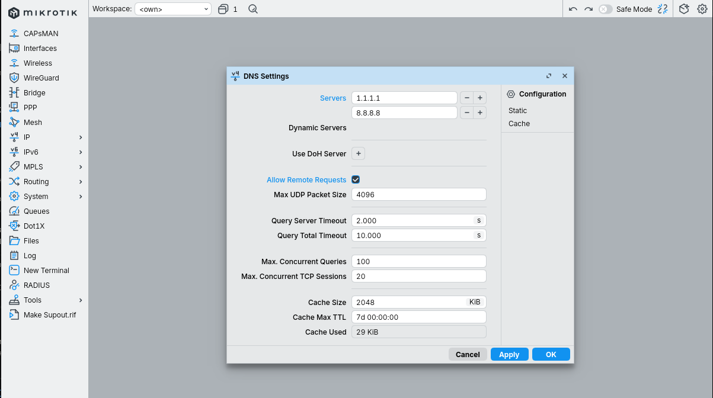

`allow-remote-requests=yes` означает что роутер сам становится DNS-сервером для LAN-клиентов. Это удобно: можно раздавать через DHCP именно IP роутера, и при смене upstream-резолверов клиентам ничего перенастраивать не надо. Но - **обязательно сразу закрыть на firewall** входящие 53/udp и 53/tcp с WAN, иначе роутер торчит как open resolver.

```
Выбор upstream DNS:

  1.1.1.1 / 1.0.0.1     - Cloudflare, быстрый, privacy-focused
  8.8.8.8 / 8.8.4.4     - Google, везде работает, логи у Google
  9.9.9.9               - Quiad9, фильтрует malware-домены
  77.88.8.8 / 77.88.8.1 - Yandex DNS (есть фильтрующие варианты)

В России - 77.88.8.8 часто быстрее зарубежных.
Cloudflare и Google периодически замедлены/блокируются.
```

Опция `Use DoH Server` в WinBox - можно прописать DNS over HTTPS (например `https://cloudflare-dns.com/dns-query`). Это шифрует DNS-трафик роутера от провайдера, но добавляет зависимость от валидного сертификата (см. пункт про правильное время).

---

## 10. Firewall - закрываем DNS от WAN (КРИТИЧНО)

Если предыдущий шаг сделан с `allow-remote-requests=yes`, без этого правила роутер - **open DNS resolver**, и это не теория. Через 24-48 часов провайдер пришлёт abuse-уведомление, через неделю отключит интерфейс.

CLI:
```
/ip firewall filter add chain=input action=drop \
    protocol=udp dst-port=53 in-interface=ether1 \
    comment="drop DNS from WAN"
/ip firewall filter add chain=input action=drop \
    protocol=tcp dst-port=53 in-interface=ether1 \
    comment="drop DNS from WAN (TCP)"
```

WinBox: `IP -> Firewall` -> вкладка `Filter Rules` -> `+`

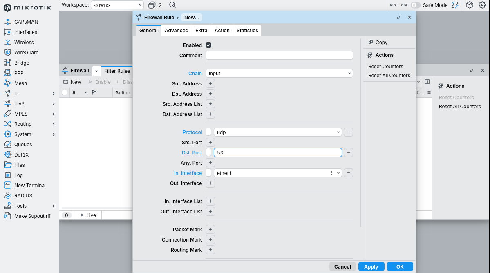
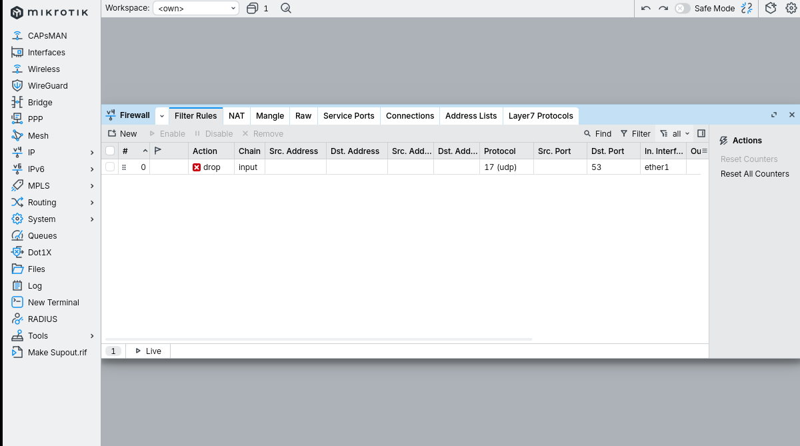

```
Что важно в правиле:

  chain=input            - трафик НА сам роутер
                           (не forward, тот про транзит)

  protocol=udp           - DNS amplification использует UDP
                           но и TCP тоже стоит закрыть отдельным правилом

  dst-port=53            - порт назначения - наш роутер слушает 53

  in-interface=ether1    - только трафик, пришедший с WAN
                           DNS-запросы из LAN через bridge не блокируются

  action=drop            - молча отбрасываем (не reject - не давать
                           атакующему обратную связь)
```

Это **первое и единственное** правило, без которого нельзя оставлять роутер с `allow-remote-requests=yes` в публичной сети. Полноценный firewall input chain - отдельная лаба (1.2).

---

## 11. Логирование

CLI:
```
/system logging add topics=info,!debug action=memory
```

WinBox: `System -> Logging` -> вкладка `Rules` -> `+`

Это базовый лог в RAM - переживёт только до перезагрузки. Для production нужен remote syslog или диск, но на этапе первичной настройки этого хватает чтобы видеть свои действия и диагностику в `Log`.

```
Topics syntax:

  info,!debug          - всё уровня info, но без debug-сообщений
  critical,error       - только серьёзное
  firewall,!debug      - только firewall-события (если есть log в правилах)
  ssh,login,account    - аутентификация
  ddns,dhcp,!debug     - инфраструктурные сервисы

  ! перед topic = исключить
```

Для долговременного хранения - `action=disk` (медленно, изнашивает SD/eMMC) или `action=remote` с указанием syslog-сервера.

---

## Проверка - что получилось

CLI (через `New Terminal` в WinBox или по SSH на 22022):

```
/system identity print
  name: BR1-GW

/system clock print
  time: 14:33:21
  date: 2026-06-12
  time-zone-name: Europe/Moscow
  gmt-offset: +03:00
  dst-active: no

/system ntp client print
  enabled: yes
  servers: ntp1.stratum1.ru,ntp2.stratum1.ru
  status: synchronized
  synced-server: ntp1.stratum1.ru

/ip service print
  # NAME      PORT  ADDRESS                       CERTIFICATE
  0 X telnet   23
  1 X ftp      21
  2   ssh      22022
  3 X www      80
  4   winbox   18291
  5 X api      8728
  6 X www-ssl  443
  7 X api-ssl  8729

/user print
  # NAME   GROUP  ADDRESS  LAST-LOGGED-IN
  0 X admin full
  1   mn   full           2026-06-12 14:30:11

/ip firewall filter print
  0 chain=input action=drop protocol=udp dst-port=53 in-interface=ether1
  1 chain=input action=drop protocol=tcp dst-port=53 in-interface=ether1
```

`X` перед именем сервиса/юзера = disabled. Всё что должно быть выключенным - выключено, всё что включено - на правильных портах.

---

## Грабли (то на чём реально ломаются)

```
1. Отключил admin до того как зашёл под собой.
   -> reset через кнопку RouterBOOT или Netinstall.
   На CHR (виртуальный) - только Netinstall или пересоздание.

2. Сменил порт WinBox, в Address не написал :18291.
   -> "Connection refused", "Connection timed out".
   В поле Connect To писать  IP:18291  или  [v6]:18291

3. Включил allow-remote-requests=yes, firewall input не настроил.
   -> через 1-3 дня abuse от провайдера или твой роутер участвует
   в DNS amplification атаке. Лечится созданием правила drop
   на 53/udp+tcp с WAN.

4. NTP не синхронизируется - status=stopped/error.
   -> Проверять в порядке: DNS (пинг по имени) -> маршрут
   (пинг по IP 8.8.8.8) -> UDP/123 не блокируется фаером.

5. Disable нужного сервиса до того как сменил его порт.
   Пример: отключил www, потом понял что нужен веб для QuickSet.
   -> Не проблема, /ip service set www disabled=no  включает обратно.

6. Пароль admin "сложный" но в keepass не сохранил.
   -> При следующем визите на объект потеряешь пол-дня.
   Любой пароль ДО рукоприкладства - в менеджер.

7. Identity по дефолту "MikroTik", забыл сменить.
   -> Через Neighbor Discovery в LAN твой роутер виден как
   "MikroTik" среди десяти других "MikroTik". Иди ищи.

8. Время на роутере врёт, сертификаты ломаются.
   -> NTP должен синхронизироваться ДО первого использования
   защищённых сервисов (IPsec, RouterOS package update).
   После большого скачка времени многое требует перезапуска.
```

---

## Что осталось за кадром

Эта лаба закрывает базовую гигиену. Дальше нужно:

- **Firewall input chain полностью** (лаба 1.2) - не только DNS, а вообще закрыть всё кроме ssh/winbox с конкретных адресов через address-list
- **Available From на сервисах** - ограничить откуда можно лезть в SSH и WinBox (через `/ip service set ssh address=10.0.0.0/8,192.168.0.0/16`)
- **Отключить Neighbor Discovery на WAN** - `/ip neighbor discovery-settings set discover-interface-list=!WAN`
- **Отключить MAC server / MAC WinBox на WAN** - чтобы нельзя было подключиться по L2 с провайдерской сети
- **Backup конфига** - `/system backup save` + `/export file=initial-config` сразу после настройки и копия с устройства
- **Обновить RouterOS до stable** - `/system package update check-for-updates` -> `download-install`
- **RoMON или отключить** - если не используется, выключить (`/tool romon set enabled=no`)
- **Логи на удалённый syslog** - чтобы при компрометации логи не были стёрты вместе с роутером
