# Базовый firewall input

В первой лабе мы закрыли базовую настройку: сменили имя, отключили admin, выключили лишние сервисы, перенесли SSH и WinBox на нестандартные порты. Но входящий трафик на роутер по-прежнему никем не фильтруется - открытые сервисы доступны откуда угодно, ICMP принимается без ограничений, любой может пытаться долбиться в SSH с дефолтной частотой запросов.

Эта лаба - первая полноценная цепочка фильтра на `input`, то есть на трафик, адресованный самому роутеру. Делаем шесть правил в правильном порядке, обсуждаем зачем каждое, и закрываем тему что должен видеть роутер из внешней сети, а что нет.

---

## Что такое chain input

```
В RouterOS firewall есть три основные цепочки в /ip firewall filter:

  input    - трафик, идущий НА сам роутер
             (ssh-подключение к роутеру, ping роутера, DNS-запросы
              к роутеру если он резолвер и т.д.)

  forward  - транзитный трафик, проходящий ЧЕРЕЗ роутер
             (трафик клиентов LAN в интернет и обратно)

  output   - трафик, исходящий ОТ самого роутера
             (когда роутер сам пингует, запрашивает обновления и т.д.)

В этой лабе работаем только с input. Forward - это защита клиентов LAN,
тема для отдельной лабы. Output почти никогда не фильтруют - роутер
должен иметь возможность исходить наружу для NTP, DNS, updates.
```

Правило в input применяется к пакету, у которого destination - сам роутер. Источник может быть любой - снаружи (WAN) или изнутри (LAN). Правильный input chain принимает то что нужно (управление с доверенных мест, ответный трафик, ограниченный ICMP) и дропает остальное.

---

## Модель угроз для input chain

```
Что прилетает на input роутера из интернета:

1. Сканеры SSH и WinBox
   Боты постоянно перебирают порты 22, 8291 и популярные нестандартные.
   Без firewall попадают в стек RouterOS, тратят CPU на проверку
   аутентификации, заполняют логи.

2. ICMP-флуд
   Атакующий шлёт тысячи ping-пакетов в секунду.
   Без rate-limit роутер тратит CPU на ответы, может тупить.

3. Invalid-пакеты
   TCP-пакеты не из существующих соединений, странные комбинации флагов,
   фрагменты непонятного назначения. Используются для разведки
   и в некоторых exploit-цепочках.

4. UDP-флуд на сервисные порты (DNS 53, NTP 123, SNMP 161)
   Особенно опасен на open resolver / open NTP - превращается
   в amplification-атаку с роутера наружу.

5. Эксплойты под конкретные сервисы
   Chimay-Red (CVE-2018-14847) долбился в WinBox 8291.
   Если порт открыт миру - уязвимость эксплуатируется удалённо.

Базовый input chain закрывает 1, 2, 3 полностью и снижает площадь
для 4 и 5 до доверенных сетей.
```

---

## Включаем Safe Mode ДО любых действий

WinBox: справа сверху, рядом с workspace, есть кнопка **Safe Mode**. Нажимаем её, она подсвечивается зелёным/красным (в зависимости от темы).

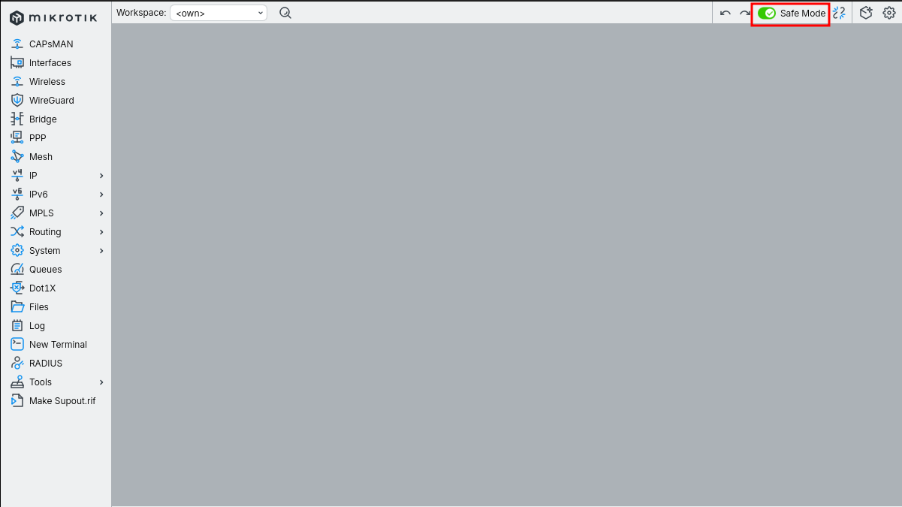

```
Что делает Safe Mode:
  Все изменения, сделанные после включения, помечаются как временные.
  Если связь с роутером оборвётся - они автоматически откатятся
  через ~9 минут.
  Чтобы зафиксировать изменения - снова нажимаем Safe Mode,
  подсветка пропадёт - значит закоммитили.

В CLI аналог - команда [safe], выход по Ctrl+D = commit,
по Ctrl+X = revert и откат.

Без Safe Mode любая ошибка в правиле "drop" может оставить
нас без управления роутером. На VPS-маршрутизаторе это особенно
критично - физического доступа нет, придётся идти в панель
провайдера за консолью.
```

---

## Убираем старые DNS-drop правила из лабы 1.1

В прошлой лабе мы добавили два точечных правила, дропающих 53/udp и 53/tcp с WAN. Теперь они становятся избыточными - финальное правило "drop WAN to router" покроет всё что прилетает с WAN, включая DNS.

WinBox: `IP → Firewall` → вкладка **Filter Rules** → выделяем старые drop-правила → красный `−` (Remove).

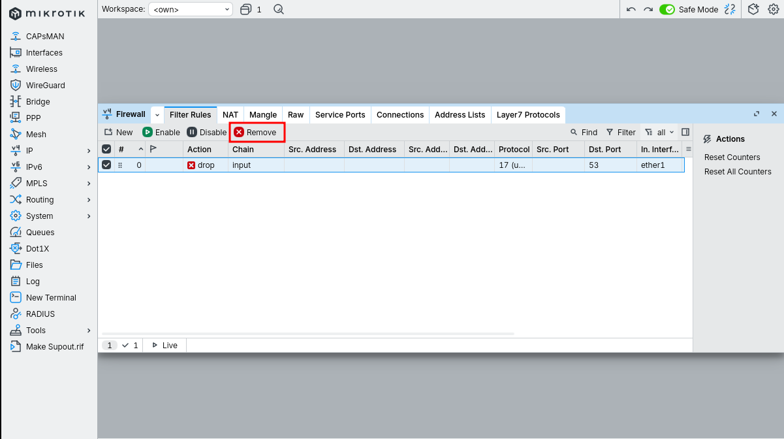

Список должен опустеть.

---

## Правило 1 - accept established, related

Это самое главное правило в любом stateful firewall, и оно должно стоять **первым**.

WinBox: `IP → Firewall → Filter Rules` → `+`.

**Вкладка General:**
- Chain: `input`

**Вкладка Advanced** (внизу General есть `Connection State` - можно отметить и там):
- Connection State: ✔ **established**, ✔ **related**

**Вкладка Action:**
- Action: `accept`

**Comment:** `accept est/rel`

OK.

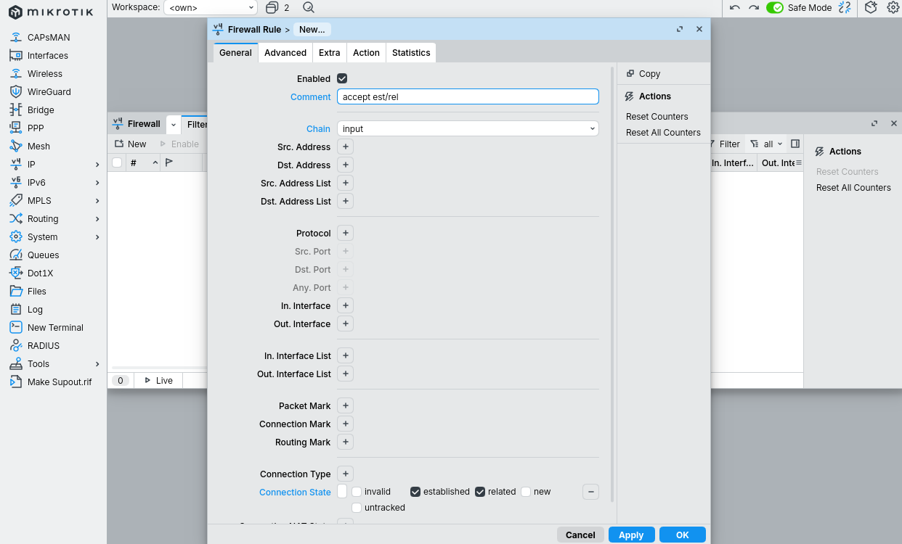
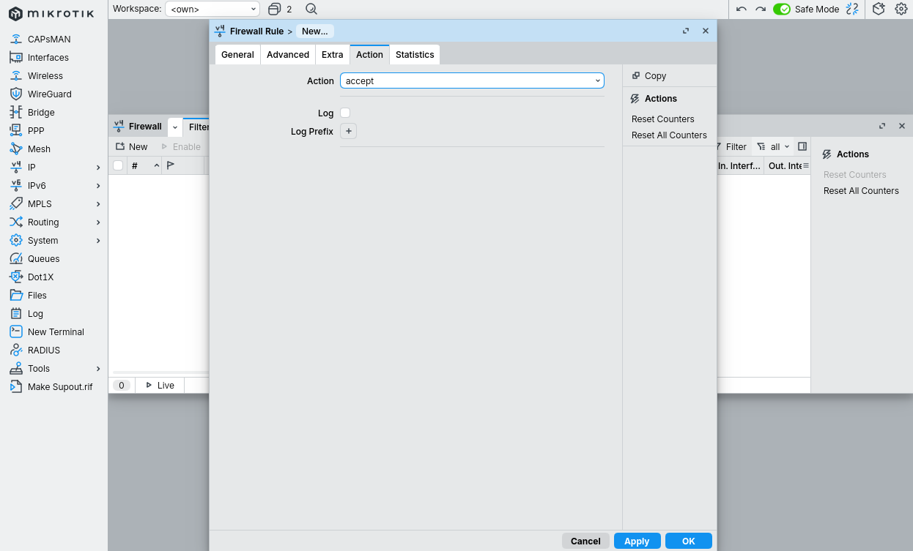

```
Зачем оно первым:

Connection tracking держит таблицу всех активных соединений
проходящих через роутер. Каждый новый пакет получает один из статусов:

  new          - первый пакет нового соединения
  established  - пакет принадлежит уже установленному соединению
  related      - связанное соединение (FTP data, ICMP errors)
  invalid      - не подходит ни под одно состояние, повреждён
  untracked    - явно исключён из connection tracking

Когда мы из роутера пингуем 8.8.8.8 - ответ приходит как established.
Когда роутер скачивает RouterOS update - ответы тоже established.
Без accept est/rel мы дропнем все эти ответы, и сам роутер
не сможет работать.

Правило стоит первым по производительности тоже:
большинство пакетов - это уже established, и им достаточно
быстрой проверки одного бита, дальше по цепочке они не идут.
```

---

## Правило 2 - drop invalid

`+`.

**General:**
- Chain: `input`
- Connection State: ✔ **invalid**

**Action:**
- Action: `drop`

**Comment:** `drop invalid`

OK.

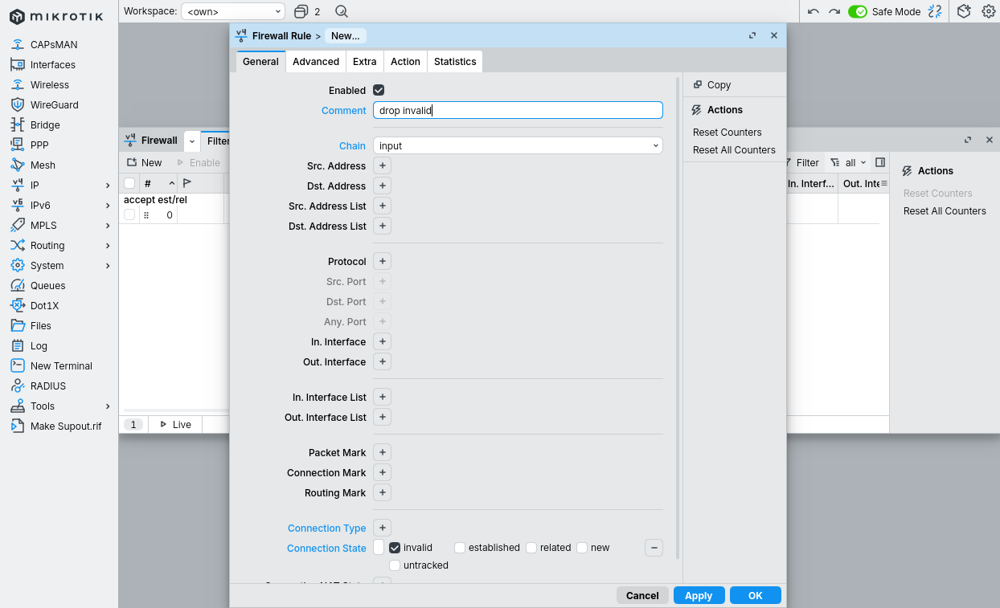
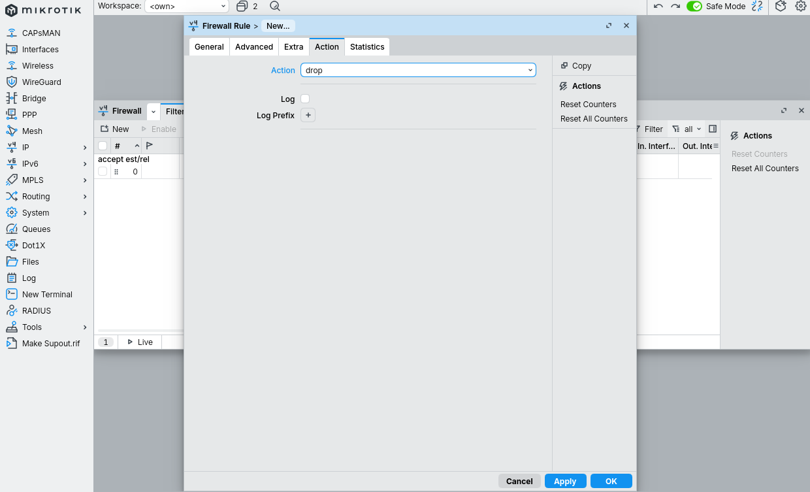

```
Что такое invalid:

Пакет, не подходящий ни под одно отслеживаемое соединение.
Например:
  - TCP с флагами не существующего соединения (FIN+SYN, RST без сессии)
  - Фрагменты пакетов которые conntrack не смог собрать
  - Out-of-window пакеты после долгой паузы
  - Спуфленные пакеты с явно нелогичными параметрами

В нормальной работе invalid-пакетов почти не бывает.
Если их много - это либо атака, либо проблема с conntrack
(переполнение таблицы, MTU, баги ПО).

Дроп таких пакетов не сломает ничего легитимного.
```

---

## Правило 3 - accept ICMP с ограничением частоты

ICMP полностью дропать не стоит - он используется для диагностики (ping, traceroute), Path MTU Discovery (без него ломаются некоторые TCP-соединения), и многих служебных вещей. Но и принимать без ограничений тоже нельзя - получим ICMP-флуд.

`+`.

**General:**
- Chain: `input`
- Protocol: `icmp` (выбрать из списка или ввести `1`)

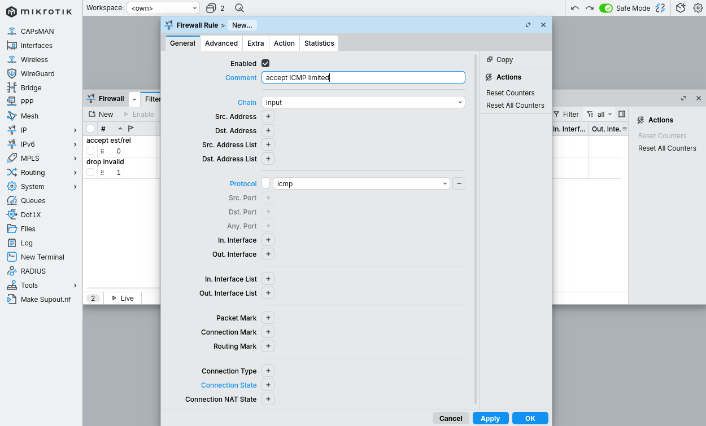

**Вкладка Extra** → раздел **Limit**:
- Rate: `1`
- Burst: `5`
- Mode: `packet`

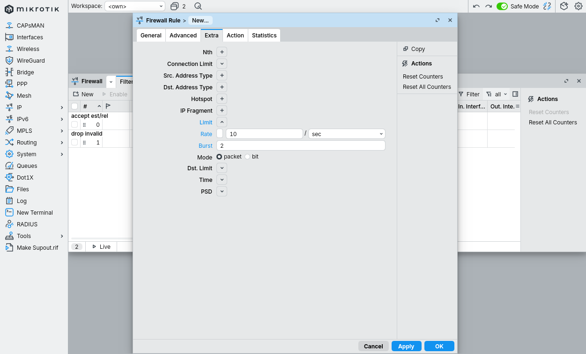

**Action:**
- Action: `accept`


**Comment:** `accept ICMP limited`

OK.

```
Как читается лимит "Rate=1, Burst=5, Mode=packet":

  В среднем разрешаем 1 ICMP-пакет в секунду
  Burst=5 - можем "взять в долг" до 5 пакетов на пиковый момент
  Mode=packet - считаем количество пакетов (не байты)

Этого хватает для:
  - ping (обычный режим, 1 пакет/сек)
  - traceroute (короткие всплески)
  - PMTU Discovery

Не хватает для:
  - ping -f (flood)
  - DDoS на ICMP

Если делаем burst-test реальный (ping -i 0.2 - 5 пакетов в секунду),
часть отвалится после первых 5 пакетов. Это нормально и желаемо.
```

---

## Правило 4 - drop excess ICMP

`+`.

**General:**
- Chain: `input`
- Protocol: `icmp`

**Action:**
- Action: `drop`

**Comment:** `drop excess ICMP`

OK.

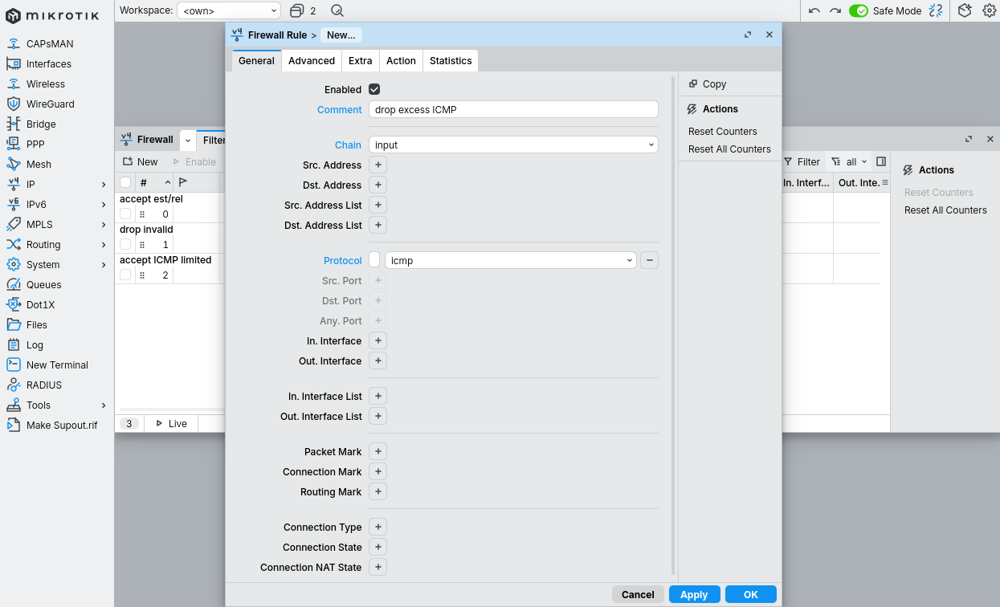
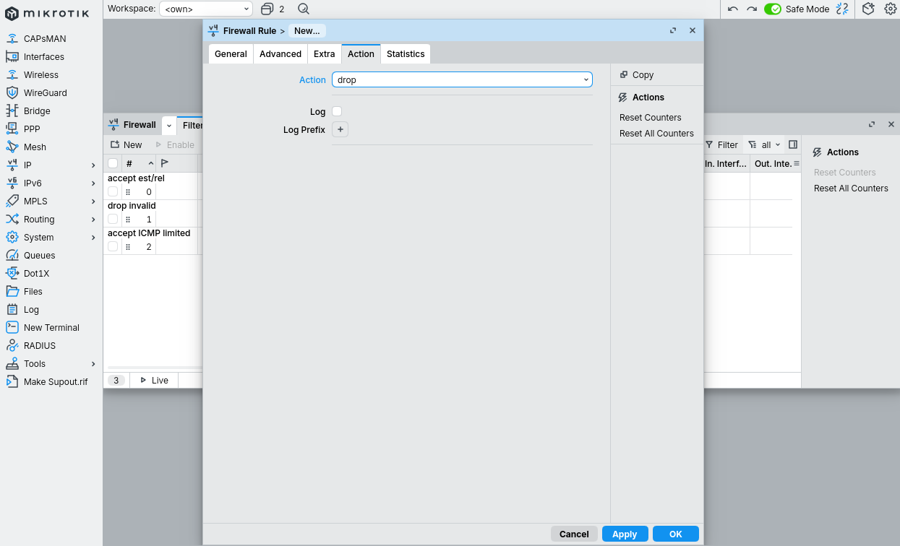

```
Логика связки правил 3 + 4:

  Пакет ICMP приходит, проверяется правилом 3.
  Если он попадает в лимит - accept, дальше по цепочке не идёт.
  Если лимит исчерпан - правило 3 НЕ матчит (limit это AND-условие,
  не отдельный action), и пакет падает в правило 4.
  Правило 4 без лимита, оно матчит любой ICMP - и дропает.

Это классический паттерн "accept под лимитом, drop остальное".
Тот же приём используется для защиты любого порта от брутфорса:
  accept TCP/22022 с лимитом 3 коннекта/мин - дальше drop.
```

---

## Правило 5 - drop WAN to router

`+`.

**General:**
- Chain: `input`
- In. Interface: `ether1` (или как у нас называется WAN-интерфейс)

**Action:**
- Action: `drop`

**Comment:** `drop WAN to router`

OK.

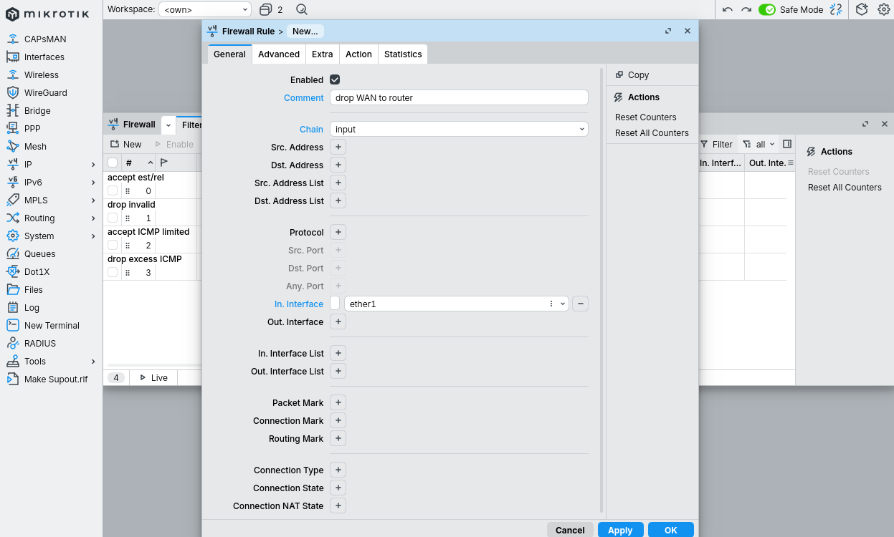
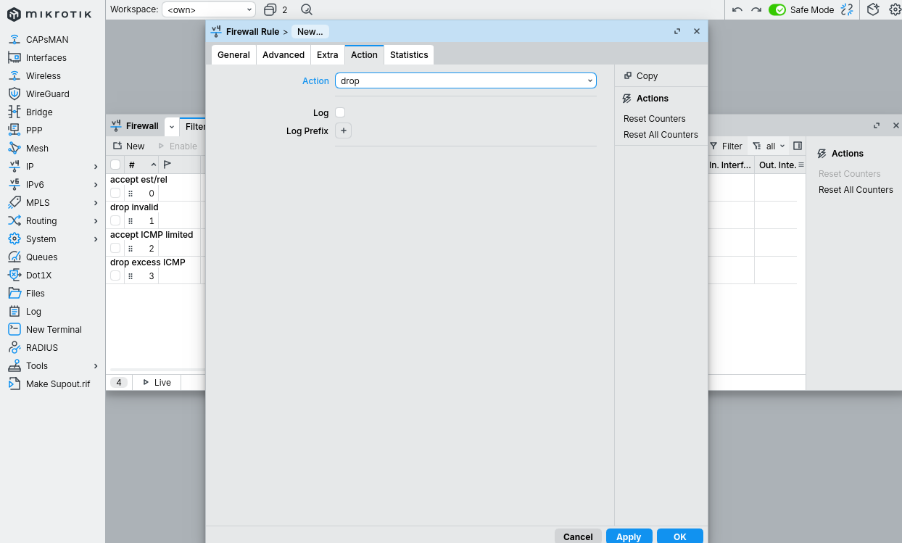

```
Что делает это правило:

Всё что прилетело с WAN-интерфейса и не было поймано раньше
(established/related, ICMP под лимитом) - дроп.

Так как правила 1 и 3 уже пропустили легитимный трафик,
сюда долетает только то, что снаружи пытается инициировать
новое подключение. На public IP - это в 99% случаев боты и сканеры.

Замечание про несколько WAN:
Если у нас два провайдера (failover, ECMP), правильнее использовать
Interface List вместо имени интерфейса:
  In. Interface List = WAN
Тогда добавление нового WAN не требует переписывать правила.
В этой лабе используем простой вариант с одним ether1.
```

---

## Правило 6 - accept LAN to router

`+`.

**General:**
- Chain: `input`
- In. Interface: `ether1` (на типовом branch-роутере здесь стоит интерфейс LAN, например `bridge-lan`; на нашем VPS-роутере с одним интерфейсом просто оставляем ether1 как в исходном плане)

**Action:**
- Action: `accept`

**Comment:** `accept LAN to router`

OK.

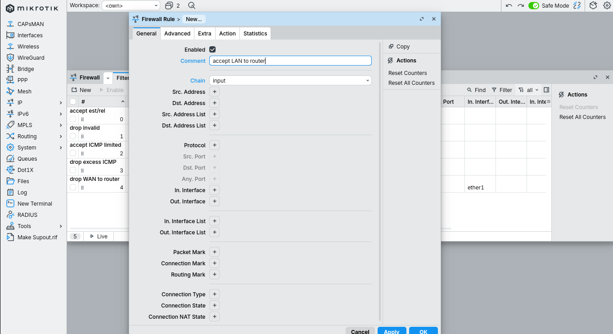
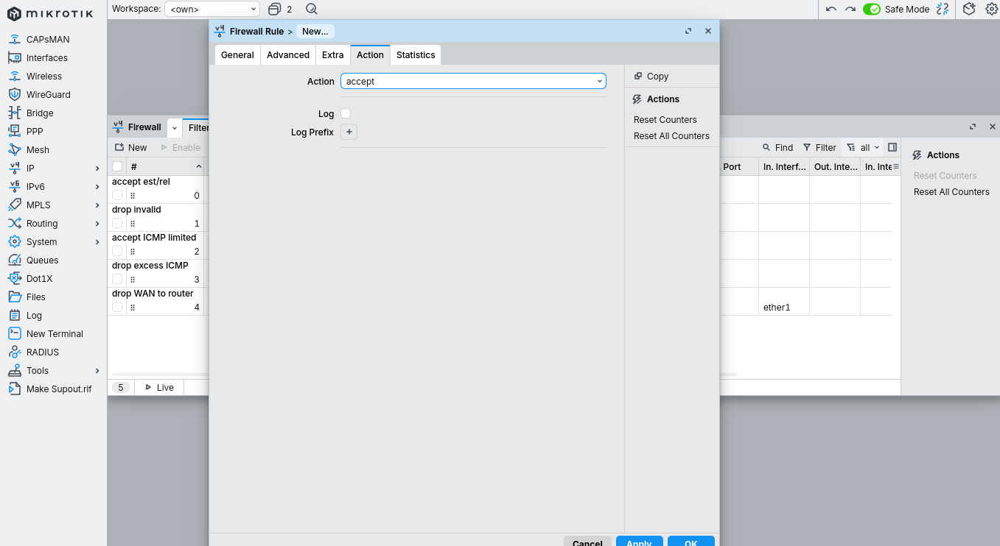

```
Логика на branch-роутере с настоящим LAN:

  Правила 1-4 пропустили или дропнули служебный трафик.
  Правило 5 дропнуло всё с WAN.
  Сюда долетает только трафик с LAN-интерфейса - его пропускаем.

  Это даёт админам LAN полный доступ к роутеру (ssh, winbox, web).
  Снаружи - ничего кроме ответов на свои запросы.

Замечание про наш конкретный VPS:
  На CHR в облаке у нас один ether1, который одновременно WAN.
  Правило 5 дропает с него всё новое, правило 6 здесь
  по сути не срабатывает (драп уже сделан).
  Управление остаётся только через уже установленную WinBox-сессию,
  пока она не закрылась. После закрытия - доступ только через
  VNC/serial-консоль провайдера.

  Правильный паттерн для VPS-роутера - не "drop WAN, accept LAN",
  а "accept SSH/WinBox с конкретного управляющего IP из address-list,
  drop остальное". Это адаптация для лабы 1.3.
```

---

## Финальный список правил

WinBox: `IP → Firewall → Filter Rules` целиком:

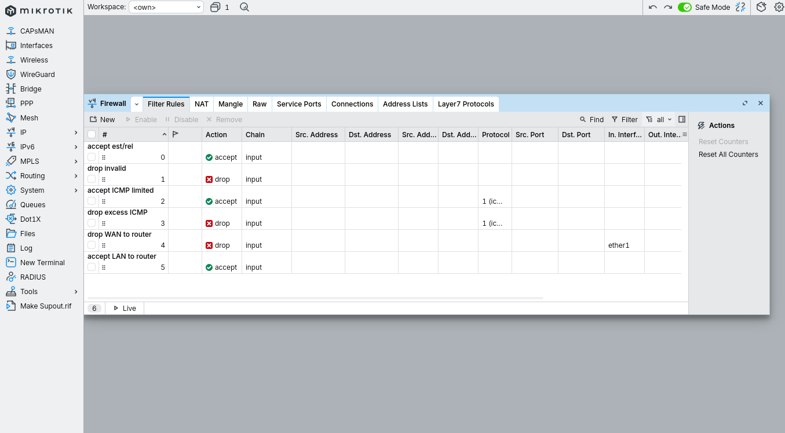

```
#  Action   Chain    Detail                                Comment
0  accept   input    conn-state=established,related        accept est/rel
1  drop     input    conn-state=invalid                    drop invalid
2  accept   input    proto=icmp  limit=1/1s,5:packet       accept ICMP limited
3  drop     input    proto=icmp                            drop excess ICMP
4  drop     input    in-interface=ether1                   drop WAN to router
5  accept   input    in-interface=ether1                   accept LAN to router
```

Порядок критичен. Firewall в RouterOS работает строго сверху вниз: первое подходящее правило выполняет action и для большинства action (accept/drop/reject) дальше пакет по цепочке не идёт.

```
Что бывает при перестановке:

  Если drop invalid поставить выше accept est/rel:
    Иногда легитимный est/rel пакет с временно "странным" состоянием
    дропается. Редко, но возможно.

  Если drop WAN поставить выше accept est/rel:
    Все исходящие из роутера запросы (NTP, DNS, update) перестанут
    получать ответы. NTP перестанет синхронизироваться, имена
    не будут резолвиться. Роутер быстро превратится в тыкву.

  Если accept LAN поставить выше drop WAN:
    На VPS без LAN ничего не изменится.
    На branch-роутере если in-interface=ether1 в правиле 6 (наша ошибка) -
    тогда правило 6 пропустит WAN-трафик, и защиты не будет вообще.
```

---

## Проверка (что должно работать после коммита Safe Mode)

На branch-роутере с настоящим LAN:

```
С LAN-клиента:
  ping <router-LAN-IP>            ->  работает
  ssh -p 22022 mn@<router-LAN-IP> ->  пускает
  winbox -> <router-LAN-IP>:18291 ->  соединяется

С WAN (внешнего хоста):
  ping <router-public-IP>         ->  отвечает (но реже 1/сек на массовый ping)
  ssh -p 22022 mn@<public-IP>     ->  таймаут
  winbox -> <public-IP>:18291     ->  таймаут
```

На нашем VPS без LAN после коммита Safe Mode SSH и WinBox с WAN недоступны - это ожидаемое следствие "drop WAN" в правиле 5. Управление - только через VNC панели провайдера, либо через адаптированную лабу 1.3 (whitelist по address-list).

В этой лабе Safe Mode мы не коммитим - оставляем как есть, чтобы через 9 минут после разрыва сессии правила откатились и доступ восстановился. Применять на production-VPS нельзя без предварительного перехода на whitelist-паттерн.

---

## Грабли

```
1. Не включили Safe Mode перед началом.
   -> Любая ошибка в drop-правиле = потеря управления.
   На железе - reset кнопкой. На VPS - VNC панель.
   Лекарство: первым делом всегда нажимаем Safe Mode.

2. Поставили drop invalid выше accept est/rel.
   -> Часть легитимного трафика иногда теряется.
   Лекарство: accept est/rel ВСЕГДА первое в input chain.

3. На VPS-роутере с одним интерфейсом сделали "drop WAN, accept LAN".
   -> После коммита потеряли управление, доступ только через VNC.
   Лекарство: на VPS используем whitelist по source-IP или
   по address-list, без полной блокировки WAN.

4. Сделали все drop-правила, но забыли accept est/rel.
   -> Сам роутер не может работать: NTP не отвечает, DNS не резолвится,
   updates не качаются. Снаружи всё закрыто, изнутри - тоже.
   Лекарство: проверяем порядок правил перед коммитом.

5. Поставили лимит на ICMP слишком жёсткий (например 1/10s, burst=1).
   -> Свои же мониторинговые пинги отваливаются, Zabbix
   рапортует "host down" хотя роутер живой.
   Лекарство: 1 пакет/сек с burst 5 - проверенный минимум,
   снижать не стоит.

6. Указали wrong in-interface (опечатка в имени, или сменили
   физический порт без правки правил).
   -> Защита не работает вообще или работает не там.
   Лекарство: использовать Interface List "WAN", добавлять
   физические порты в список, а не править firewall.

7. В правиле 6 указали in-interface=ether1 на роутере с настоящим LAN.
   -> Это правило теперь принимает трафик С WAN, что отменяет
   правило 5. Firewall превращается в "accept всё с WAN".
   Лекарство: на branch-роутере правило 6 = либо пустое
   in-interface (catch-all), либо явно in-interface=bridge-lan.

8. Закоммитили Safe Mode и закрыли WinBox, потом обнаружили
   что что-то не работает.
   -> Откатить уже нельзя без захода в роутер.
   Лекарство: после коммита Safe Mode сразу проверяем все
   нужные доступы из нового окна WinBox/SSH, перед закрытием
   рабочей сессии.
```

---

Базовый input chain закрыт, но настоящий production-firewall - это больше:

- **Address-list whitelist для управления** - не "drop WAN", а "accept ssh/winbox только с управляющих IP, drop остальное". Лаба 1.3.
- **Drop bogons** - дропать source-адреса из RFC1918 / RFC6890 на WAN (никто из интернета не должен слать пакеты с 192.168.0.0/16).
- **Port-knocking или dynamic address-list** - открывать управление "по стуку" в определённый порт, чтобы порт SSH вообще не светился.
- **Логирование подозрительного** - не drop с log=yes (заспамит), а добавление в blacklist на сутки и тогда уже drop.
- **Forward chain** - защита клиентов LAN: блок входящего из интернета на их адреса (с поправкой на NAT), дроп исходящего на malware-домены и т.д.
- **Output chain** - в особо параноидальных случаях.
- **Raw chain** - для очень высоконагруженных сценариев, до conntrack, чтобы не тратить ресурсы на явный мусор.
