# Защита от brute-force на SSH и WinBox"


После лабы 1.2 у нас есть базовый input chain: established/related пропускается, invalid дропается, ICMP ограничен, всё с WAN режется. Этого хватает чтобы роутер не отвечал на новые подключения извне - но в логах роутер всё равно тратит ресурсы на обработку каждой попытки сканера, и в `/log print` каждые несколько секунд появляются записи типа "input drop".

Эта лаба - адаптация классического fail2ban-паттерна для RouterOS, реализованная через **dynamic address lists**. Идея: первая попытка подключения к SSH или WinBox с незнакомого IP - добавляем в первый список с коротким timeout. Если за этот timeout пришла ещё одна попытка - переводим в следующий список. После 3-4 переходов IP попадает в blacklist на сутки, и любые новые пакеты с него молча дропаются ещё до основной цепочки.

Без установки внешнего ПО, без скриптов, целиком на стандартных правилах firewall.

---

## Идея каскада

```
Сканер атакует SSH на порту 22022 с IP X.X.X.X:

  Попытка 1:  X.X.X.X не в списках -> добавляем в ssh-stage1 на 1 минуту
  Попытка 2:  X.X.X.X в ssh-stage1 -> переводим в ssh-stage2 на 1 минуту
  Попытка 3:  X.X.X.X в ssh-stage2 -> переводим в ssh-stage3 на 1 минуту
  Попытка 4:  X.X.X.X в ssh-stage3 -> переводим в ssh-blacklist на 1 сутки
  Попытка 5+: X.X.X.X в blacklist  -> drop, дальше по цепочке не идёт

После 1 минуты бездействия из stage1/stage2/stage3 IP вылетает
(timeout истёк). Если атакующий медленный (1 попытка в 90 секунд),
он бесконечно болтается в stage1 и в blacklist не попадает.
Это компромисс: либо быстрая блокировка с риском задеть медленных
легитимных пользователей, либо мягкая - но боты как раз "медленные"
могут пройти.
```

Этот паттерн работает в любом stateful firewall и впервые описан в [официальной MikroTik wiki](https://wiki.mikrotik.com/wiki/Bruteforce_login_prevention) много лет назад - кочует из конфига в конфиг как стандарт de-facto.

---

## Что такое dynamic address list

```
В RouterOS address-list - это именованный набор IP-адресов.
Записи бывают двух типов:

  static     - руками заведённые через /ip firewall address-list add
               Остаются до явного удаления.

  dynamic    - добавлены автоматически (например, через firewall action
               add-src-to-address-list или add-dst-to-address-list)
               Имеют timeout, после которого автоматически исчезают.
               В WinBox помечены буквой "D" слева.

Один и тот же IP может быть в нескольких списках одновременно
(например, и в ssh-stage1, и в ssh-blacklist - если он сейчас
в blacklist и параллельно опять попробовал подключиться).

После перезагрузки роутера ВСЕ dynamic записи исчезают.
Для сохранения blacklist между ребутами нужен отдельный скрипт
(тема для лабы 1.5).
```

---

## Ключевая особенность action `add-src-to-address-list`

```
Это action типа "no-op для пакета" - в отличие от accept/drop/reject,
он НЕ останавливает обработку. Пакет продолжает идти по цепочке.

  Правило 8: action=add-src-to-address-list (target=ssh-stage1)
             -> IP добавлен в список, пакет идёт дальше
  Правило 9: ...
  ...
  Правило 13: drop WAN -> здесь пакет умирает.

Значит порядок add-правил относительно друг друга важен.
Если поставить "new -> stage1" ПЕРЕД "stage1 -> stage2", оба сработают
на один и тот же пакет:
  - сначала IP добавится в stage1 (правило new)
  - затем сразу же IP перейдёт в stage2 (правило stage1)
И каскад сломается - IP за одну попытку прыгает на два уровня.

Правильный порядок - от "самого продвинутого" к "самому базовому":
  stage3 -> blacklist  (первым: чтобы упорные сразу в бан)
  stage2 -> stage3
  stage1 -> stage2
  new    -> stage1     (последним: тут всё что не подошло выше)

При такой расстановке на каждый пакет срабатывает РОВНО ОДНО
правило-перевода (потому что src-address-list разные).
```

---

## Включаем Safe Mode

WinBox: кнопка **Safe Mode** вверху → нажать, подсветка загорелась.

Здесь Safe Mode особенно важен - правила оперируют src-address-list, и если в процессе настройки мы сами окажемся в ssh-stage1 (например, делая тестовые подключения), а потом случайно перепутаем правила - можем сами себя в blacklist положить. Откатиться без консоли провайдера будет невозможно.

---

## Правило `ssh blacklisted` (позиция 3)

WinBox: `IP → Firewall → Filter Rules` → `+`.

**General:**
- Chain: `input`
- Src. Address List: `ssh-blacklist`

**Action:**
- Action: `drop`

**Comment:** `ssh blacklisted`

OK.

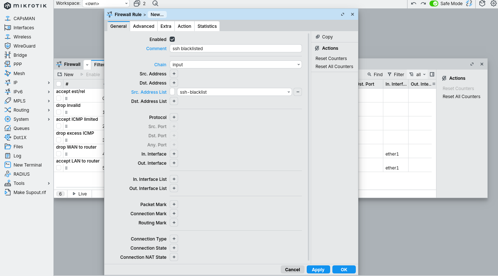
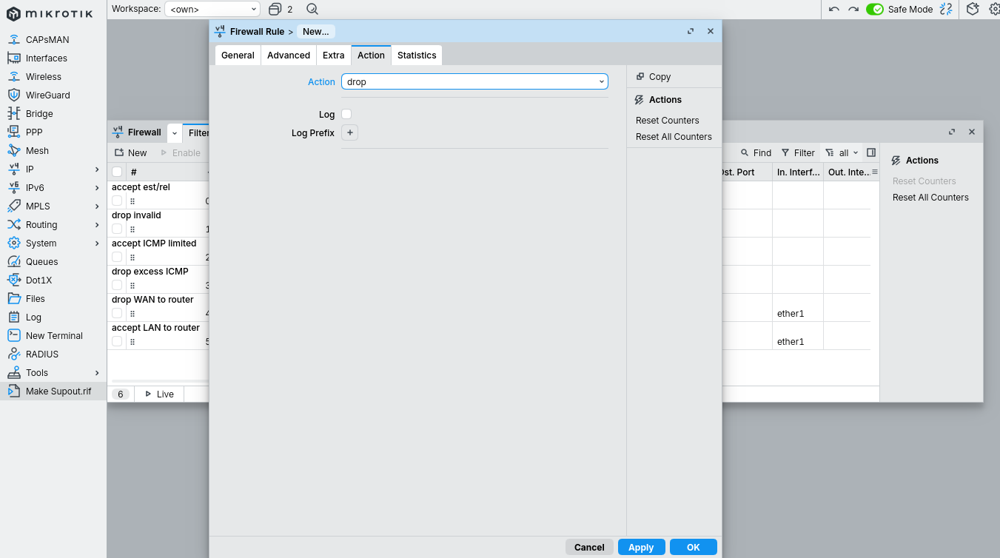

Перетаскиваем правило мышкой на позицию 3 - сразу после `accept ICMP limited`. Это блок "уже определённые враги" - они дропаются первыми, до любого анализа протокола или порта, экономя CPU и не создавая записей в трекинге попыток.

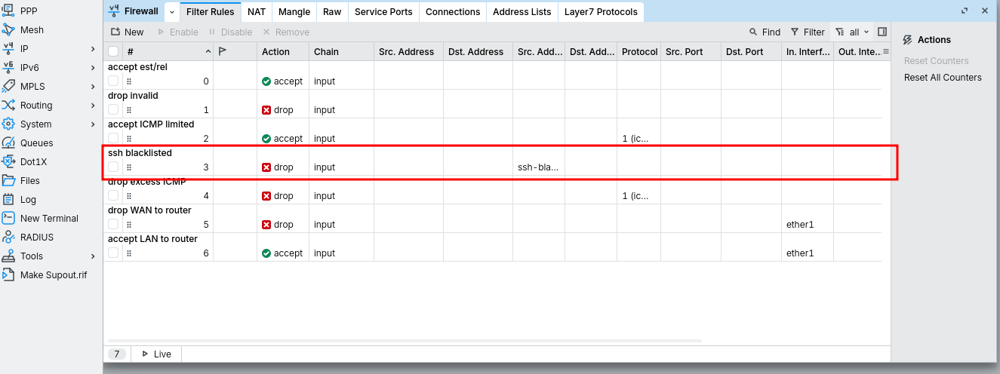

```
Почему именно на позиции 3, а не выше:
  accept est/rel должен оставаться первым - иначе вернётся проблема
  из лабы 1.2 (роутер сам не получает ответы на свои запросы).
  drop invalid вторым - валидируем connection tracking.
  accept ICMP limited третьим - не задерживаем диагностику.
  И только потом - ssh-blacklist drop, до любой обработки TCP.
```

---

## Правило `winbox blacklisted` (позиция 4)

Самый быстрый способ - **Copy** уже созданного правила.

WinBox: правый клик на `ssh blacklisted` → **Copy**. Открывается копия.

Меняем:
- Src. Address List: `winbox-blacklist`
- Comment: `winbox blacklisted`

OK.

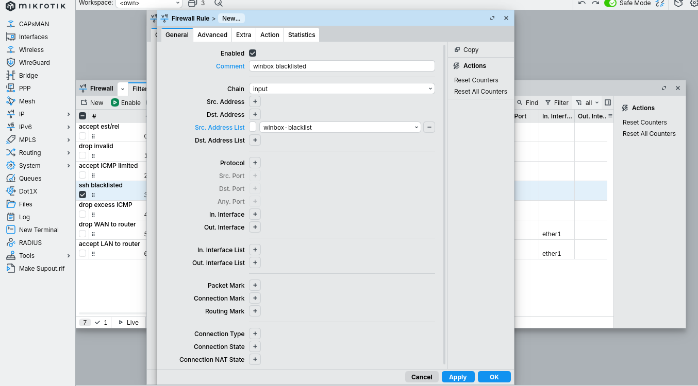

Перетаскиваем на позицию 4.

```
Можно ли использовать ОДИН blacklist для SSH и WinBox?

  Да, технически - указали бы оба правила drop с одним
  src-address-list=mgmt-blacklist, и любая попытка брутфорса
  на SSH автоматически блокировала бы и WinBox.

  Но раздельные списки удобнее на практике:
  - Видим отдельно "кто долбится в SSH" и "кто в WinBox"
  - Можем разные таймауты ставить
  - Можем разной строгости каскад строить (например, для WinBox
    мягче, потому что админы там чаще промахиваются с паролем)

  В этой лабе делаем раздельно.
```

---

## SSH каскад - правила 5-8

Четыре правила, в порядке "от самого продвинутого к новому":

### Правило 5 - ssh stage3 → blacklist

`+`. Если хотим сэкономить - **Copy** правила blacklist drop и переделываем.

**General:**
- Chain: `input`
- Protocol: `tcp`
- Dst. Port: `22022`
- Src. Address List: `ssh-stage3`

**Action:**
- Action: `add src to address list`
- Address List: `ssh-blacklist`
- Timeout: `1d`

**Comment:** `ssh stage3->blacklist`

OK.

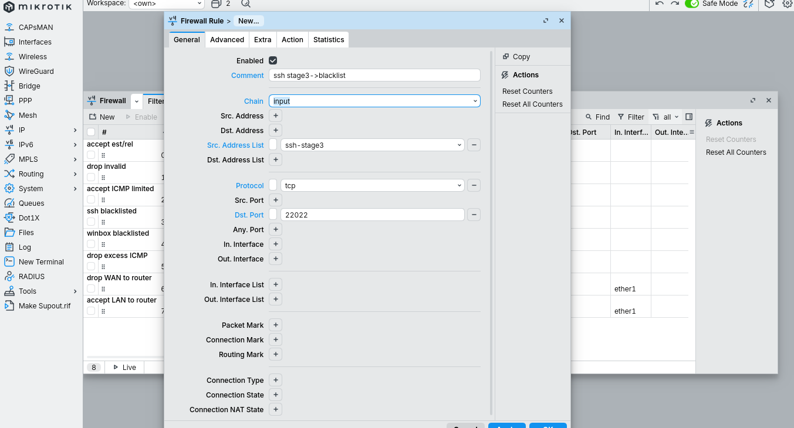
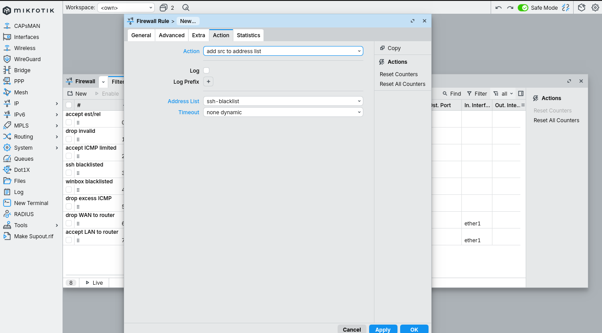

```
КЛЮЧЕВАЯ деталь action:

  В выпадающем списке Action выбираем "add src to address list"
  (не путать с "add dst to address list" - этот для исходящих).

  Появляются дополнительные поля:
    Address List: ssh-blacklist  - КУДА добавить
    Timeout: 1d                  - на сколько (1 день = 86400 сек)

  Если Timeout оставить пустым = "none dynamic":
  IP добавляется БЕЗ таймаута - до перезагрузки роутера.
  Это вариант для совсем параноидальных - на VPS не рекомендую,
  можно засрать список собственным IP при неудачной отладке.
```

Перетаскиваем правило на позицию 5.

### Правило 6 - ssh stage2 → stage3

**Copy** правила 5, меняем:
- Src. Address List: `ssh-stage2`
- Address List (в Action): `ssh-stage3`
- Timeout: `1m`
- Comment: `ssh stage2->stage3`

OK.

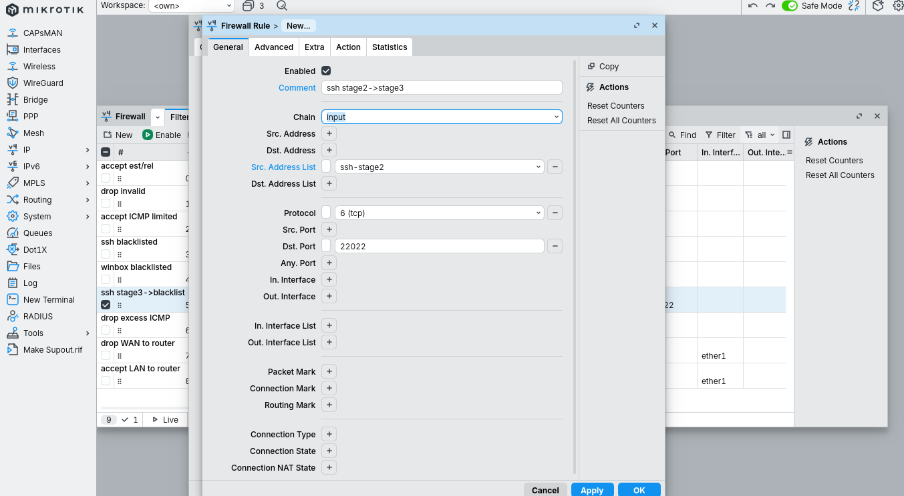
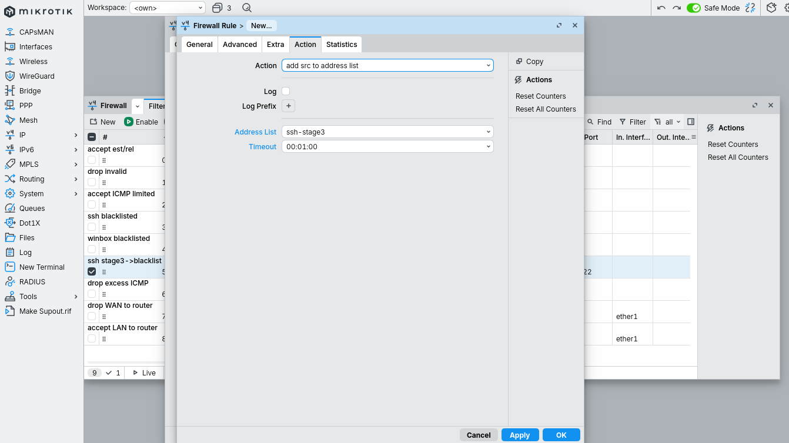

Позиция 6.

### Правило 7 - ssh stage1 → stage2

**Copy** правила 6, меняем:
- Src. Address List: `ssh-stage1`
- Address List: `ssh-stage2`
- Timeout: `1m`
- Comment: `ssh stage1->stage2`

OK.

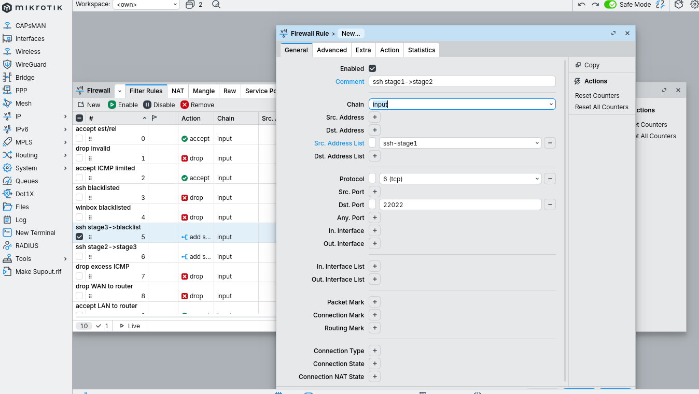
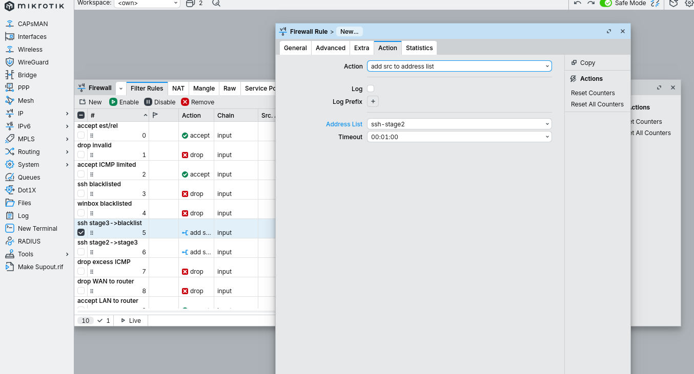

Позиция 7.

### Правило 8 - ssh new → stage1

**Copy** правила 7, меняем:

**General:**
- Src. Address List: **очистить поле** (нажать `−` рядом, поле должно стать пустым)
- Connection State: ✔ **new** (это добавится в нижней части General)

**Action:**
- Address List: `ssh-stage1`
- Timeout: `1m`

**Comment:** `ssh new->stage1`

OK.

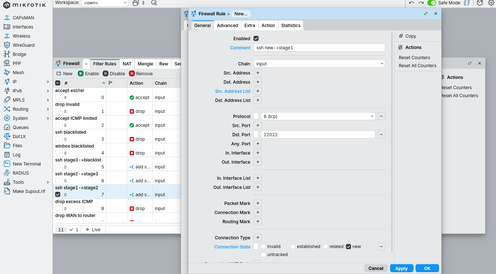
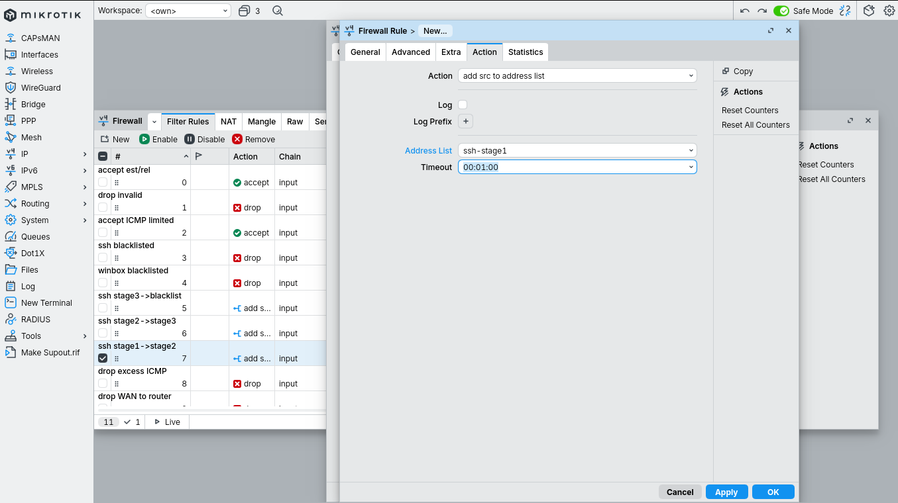

Позиция 8.

```
Почему здесь нет src-address-list, но есть connection-state=new:

  src-address-list пустой = "сработает на любой исходный IP".
  Это правило-ловушка, оно матчит ВСЕХ.

  Но если оставить только это условие, правило будет триггериться
  на established/related пакеты тоже, и легитимные SSH-сессии будут
  пытаться повторно добавить себя в stage1 при каждом пакете.
  Список переполнится мусором.

  connection-state=new ограничивает: только первый пакет
  нового соединения добавляется. Остальные пакеты сессии
  идут мимо этого правила (они established).
```

---

## WinBox каскад - правила 9-11

По нашему примеру делаем три правила для WinBox (порт 18291). Каскад получается короче - всего 3 правила вместо 4: `stage3->blacklist`, `stage2->stage3`, `new->stage1`. Промежуточное `stage1->stage2` пропускаем.

```
Что это значит на практике:

  Полный каскад (4 правила):
    Попытка 1 -> stage1, 2 -> stage2, 3 -> stage3, 4 -> blacklist

  Сокращённый каскад (3 правила, без stage1->stage2):
    Попытка 1 -> stage1
    Попытка 2 -> ничего не происходит (нет правила stage1->stage2)
                 IP остаётся в stage1
    Попытка 3 -> через минуту stage1 истёк, IP опять -> stage1 (попытка 1)

  То есть в blacklist бот по WinBox-порту НЕ попадает.
  Защита остаётся только через основной drop WAN.
  
  Это известный пропуск - в правильной production-схеме
  каскад должен быть полным. В этой лабе оставляем как есть
  для демонстрации концепта; в финальном виде добавляем
  четвёртое winbox-правило (см. "Что осталось за кадром").
```

### Правило 9 - winbox stage3 → blacklist

**Copy** правила 5 (`ssh stage3->blacklist`), меняем:
- Dst. Port: `18291`
- Src. Address List: `winbox-stage3`
- Address List (Action): `winbox-blacklist`
- Comment: `winbox stage3->blacklist`

Позиция 9.

### Правило 10 - winbox stage2 → stage3

**Copy** правила 6 (`ssh stage2->stage3`), меняем:
- Dst. Port: `18291`
- Src. Address List: `winbox-stage2`
- Address List: `winbox-stage3`
- Comment: `winbox stage2->stage3`

Позиция 10.

### Правило 11 - winbox new → stage1

**Copy** правила 8 (`ssh new->stage1`), меняем:
- Dst. Port: `18291`
- Address List (Action): `winbox-stage1`
- Comment: `winbox new->stage1`

Позиция 11.

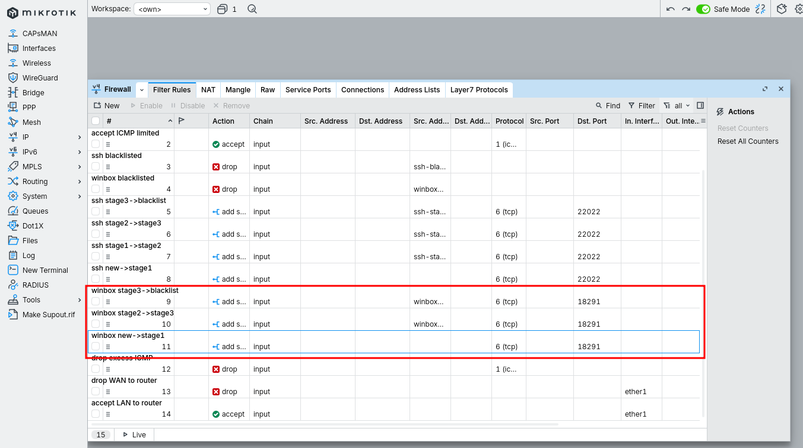

---

## Финальный порядок правил

WinBox: `IP → Firewall → Filter Rules` - вся таблица:

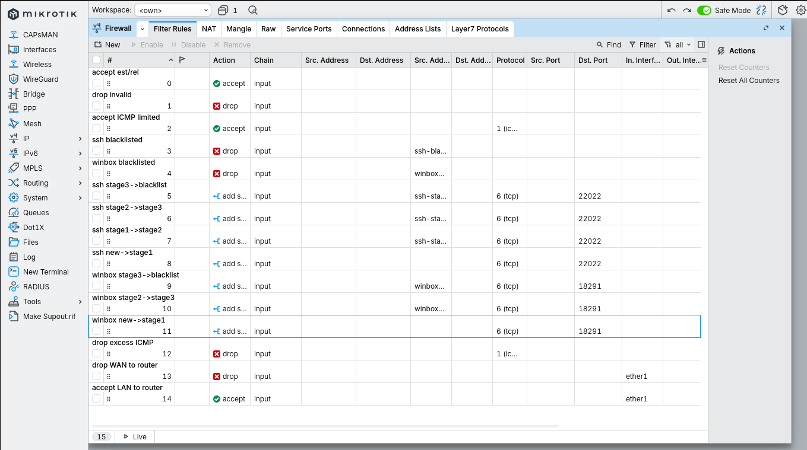

```
#   Action   Chain   Detail                                         Comment
0   accept   input   conn-state=est,rel                             accept est/rel
1   drop     input   conn-state=invalid                             drop invalid
2   accept   input   proto=icmp +limit                              accept ICMP limited
3   drop     input   src-list=ssh-blacklist                         ssh blacklisted
4   drop     input   src-list=winbox-blacklist                      winbox blacklisted
5   add-list input   tcp/22022 src-list=ssh-stage3 -> blacklist 1d  ssh stage3->blacklist
6   add-list input   tcp/22022 src-list=ssh-stage2 -> stage3 1m     ssh stage2->stage3
7   add-list input   tcp/22022 src-list=ssh-stage1 -> stage2 1m     ssh stage1->stage2
8   add-list input   tcp/22022 conn-state=new -> stage1 1m          ssh new->stage1
9   add-list input   tcp/18291 src-list=winbox-stage3 -> blacklist  winbox stage3->blacklist
10  add-list input   tcp/18291 src-list=winbox-stage2 -> stage3 1m  winbox stage2->stage3
11  add-list input   tcp/18291 conn-state=new -> stage1 1m          winbox new->stage1
12  drop     input   proto=icmp                                     drop excess ICMP
13  drop     input   in-interface=ether1                            drop WAN to router
14  accept   input   in-interface=ether1                            accept LAN to router
```

```
Замечание про положение "drop excess ICMP" на 12:

  В лабе 1.2 это правило было на позиции 3, сразу после accept ICMP.
  После добавления 9 новых правил оно уехало на 12.

  Функционально это не сломалось. Между accept ICMP (поз. 2) и
  drop excess ICMP (поз. 12) нет ни одного ICMP-правила -
  все 9 правил между ними фильтруют только TCP/22022 и TCP/18291.
  ICMP-пакеты их игнорируют и доходят до правила 12.

  Если хотим аккуратности - можем перетащить drop excess ICMP
  обратно на позицию 3, рядом с accept ICMP limited. Это правильнее
  с точки зрения "связанные правила держим рядом", но на работу
  не влияет.
```

---

## Проверка через 5-10 минут

WinBox: `IP → Firewall` → вкладка **Address Lists**.

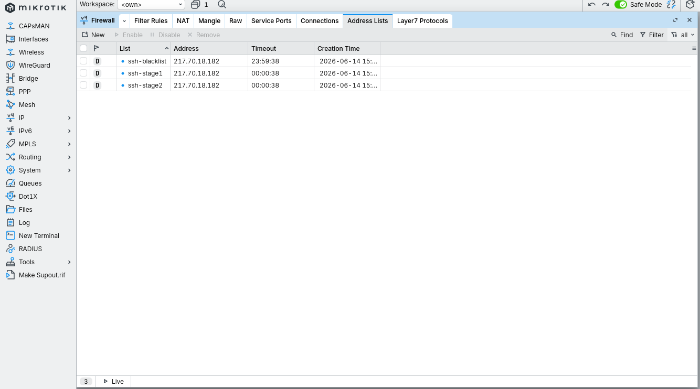

В списках должны появиться записи помеченные `D` (dynamic) с уменьшающимся timeout:

```
ssh-stage1     192.0.2.45    timeout 47s    D
ssh-stage1     203.0.113.8   timeout 31s    D
ssh-stage2     45.142.x.x    timeout 12s    D
ssh-blacklist  92.255.x.x    timeout 23h58m D
```

Через CLI (`New Terminal`):
```
/ip firewall address-list print where dynamic=yes
```

```
Нормальное наполнение через сутки на публичном IP:
  ssh-stage1:     десятки IP (все сканеры что зашли один раз)
  ssh-stage2:     единицы (зашли дважды за минуту)
  ssh-stage3:     единицы (зашли трижды)
  ssh-blacklist:  единицы за сутки (упорные брутфорсеры)

Если в blacklist пусто через несколько часов - значит сканеры
заходят медленно (раз в минуту с большим интервалом) и не успевают
дойти до bana. Это норма, не баг.

Если в blacklist твой собственный IP - см. "Грабли".
```

---

## Важное замечание про VPS

```
На нашем CHR с одним ether1 (он же WAN) каскад работает,
но защищает не так, как на branch-роутере.

На branch-роутере (с настоящим LAN):
  - Легитимный пользователь из интернета попадает в каскад
  - После 4 неудачных попыток - в blacklist
  - До этого попытки реально дроп'аются ИМЕННО потому что
    нет accept-правила для SSH (или есть только с whitelist)

На нашем VPS:
  - Сканеры добавляются в каскад (хорошо, видим их в address-list)
  - Но все пакеты в любом случае умирают на правиле 13 (drop WAN)
  - То есть каскад работает как ТРЕКЕР, а не как защита -
    защиту обеспечивает drop WAN, а каскад просто заранее
    помечает повторных нарушителей

  Реальную пользу каскад даёт когда blacklist срабатывает раньше
  основных правил: пакет от уже-известного бота дропается на
  правиле 3 (одна проверка вместо прохождения всей цепочки).
  Это экономит CPU при массовом сканировании.

  Чтобы каскад реально защищал от brute-force на легитимный
  SSH/WinBox с интернета - нужно либо whitelist по управляющему IP
  (см. план для лабы 1.4), либо открыть SSH/WinBox через VPN
  (план для раздела 5).
```

---

## Закоммитить Safe Mode

Перед коммитом обязательно проверяем что:
1. Мы сами не находимся ни в одном `*-stage*` или `*-blacklist` (`/ip firewall address-list print where address=<наш-IP>`)
2. Можем подключиться из нового окна WinBox/SSH к роутеру
3. Address Lists начали наполняться

WinBox: кнопка **Safe Mode** ещё раз → подсветка погасла → правила зафиксированы.

---

## Грабли

```
1. Перепутали порядок add-правил в каскаде.
   -> Один пакет триггерит несколько правил подряд (потому что
   add-src-to-address-list не останавливает обработку), IP за одну
   попытку прыгает в blacklist.
   Лекарство: stage3 -> stage2 -> stage1 -> new, именно в таком
   порядке. От самого продвинутого условия к самому базовому.

2. Поставили drop blacklisted ПОСЛЕ каскада.
   -> Бан срабатывает с задержкой в одну попытку: blacklist'нутый IP
   проходит через все add-правила (не дропается), и только потом
   дроп. Не критично, но засирает CPU и логи.
   Лекарство: оба drop blacklisted - выше всех add-правил.

3. Каскад без conn-state=new в правиле "new->stage1".
   -> Каждый пакет established-сессии повторно добавляет наш IP
   в stage1. Через минуту работы наш собственный IP в stage1,
   и при следующем коннекте мы продвигаемся в stage2 -> stage3
   -> blacklist. Себя забанили.
   Лекарство: ВСЕГДА connection-state=new в "новых" правилах.

4. Сами попали в blacklist при тестировании.
   -> Через 1 день timeout и сами выходим. Если ждать долго:
   - WinBox по MAC через L2 (только в одном broadcast-domain)
   - VNC панель провайдера для VPS
   - Reset кнопка для физического роутера
   - /ip firewall address-list remove [find list=ssh-blacklist] из консоли

5. Каскад из 3 правил вместо 4 (пропущен промежуточный stage).
   -> Атакующий до blacklist'а не добирается, защита через каскад
   не работает - работает только основной drop.
   Лекарство: в production-схеме всегда полный 4-уровневый каскад
   на каждый защищаемый порт.

6. Timeout каскада слишком короткий (по умолчанию 1m).
   -> Медленные брутфорсеры (1 попытка раз в 90 секунд) бесконечно
   болтаются в stage1 и в blacklist не попадают. Современные боты
   именно так и делают, чтобы обходить fail2ban.
   Лекарство: увеличить timeout до 5m-10m. Trade-off - дольше
   будут вылетать собственные ошибочные попытки.

7. Один blacklist на оба сервиса без раздельных каскадов.
   -> Технически безопаснее (попался в SSH - закрыт и WinBox),
   но теряем видимость "кто откуда долбится".
   Лекарство: вкус. Раздельно - нагляднее. Общий - чуть жёстче.

8. blacklist без timeout (none-dynamic).
   -> При собственной ошибке IP в бане до перезагрузки роутера.
   На VPS лечится VNC, на железе - reset.
   Лекарство: ставить timeout=1d или 7d, точно не "none".
   Перманентный бан делается отдельным static-правилом руками.

9. Положение drop excess ICMP уехало вниз при добавлении правил.
   -> Не работает ничего страшного, но красота нарушена.
   Лекарство: после каждой лабы проверяем порядок и при необходимости
   перетаскиваем правила обратно на правильную позицию.

10. Не сохранили blacklist между перезагрузками.
    -> После ребута все динамические записи исчезают, атакующим
    нужно начать с stage1.
    Лекарство: лаба 1.5 - скрипт сохранения address-list в файл
    и восстановления при загрузке.
```

---

- **Полный каскад для WinBox** - добавить пропущенное `winbox stage1->stage2` правило, чтобы защита была симметрична с SSH.
- **Сохранение blacklist между перезагрузками** - скрипт `/system scheduler` с `/ip firewall address-list export file=` каждые N часов и `/import` при загрузке. Тема лабы 1.5.
- **Адаптация для VPS - whitelist по management address-list** - чтобы каскад реально защищал, а не просто трекал. Тема лабы 1.4.
- **Учёт повторных нарушителей** - dedicated "long-term-blacklist" куда попадают IP, побывавшие в обычном blacklist уже несколько раз. Таймаут - 30 дней или permanent.
- **Защита от distributed brute-force** - когда атакующие используют ботнет и каждый IP делает по 1-2 попытки. Address-list не помогает (timeout срабатывает раньше bana). Лечится только VPN-доступом к управлению.
- **Логирование bans** - `action=add-src-to-address-list` + `log=yes` на правиле stage3->blacklist, чтобы в `/log` была запись каждый раз когда кто-то отправился в бан.
- **Защита других сервисов** - если включён www-ssl (на нестандартном порту), повторяем тот же каскад с другим именем списков (`web-stage1` и т.д.).
