# Резервное копирование и автоэкспорт

В предыдущих лабах мы настроили роутер: hardening, базовый firewall, защита от brute-force. Каждое из этих изменений было сложнее предыдущего, и если сейчас роутер ляжет (умрёт диск, кто-то стёр конфиг, обновление пошло не так) - восстанавливать всё с нуля по памяти будет очень больно.

Эта лаба - про автоматический локальный бэкап конфигурации каждую ночь, плюс подготовка для забора файлов с роутера на внешний сервер. Делаем скрипт, ставим scheduler, тестируем вручную, настраиваем SSH-ключ для пользователя `mn` (без пароля, под cron-скрипт на Linux).

Бэкапы должны быть автоматическими. Бэкапы, которые "я каждое утро вручную скачиваю в Files" - это не бэкапы, это иллюзия бэкапов: рано или поздно забудем, заболеем, уйдём в отпуск.

---

## Модель угроз и потерь

```
Что мы хотим пережить:

1. Аппаратный отказ (флешка, eMMC, диск VPS)
   На железных MikroTik СНК(SD/eMMC) выходит из строя за 3-5 лет.
   На CHR диск VPS может умереть от любой проблемы у провайдера.
   Без бэкапа - покупаем новое железо, настраиваем с нуля. Часы.

2. Ошибка в конфиге (свои или чужие руки)
   "Случайно стёр firewall", "перезаписал интерфейсы скриптом",
   "обновление RouterOS похерило BGP-конфиг". С бэкапом - откат
   за минуту, без - длинные часы выяснения "что я тут наделал вчера".

3. Компрометация роутера
   Если получили доступ к управлению, могут стереть всё или
   подменить пароли. После восстановления контроля нужно знать
   "как было ДО атаки" - бэкап в защищённом месте.

4. Замена железа на новое
   Покупаем то же самое - заливаем .backup, конфиг переезжает целиком.
   Без бэкапа - переписываем 200+ строк руками.

5. История изменений ("когда сломалось?")
   Бэкап вчера, бэкап позавчера, бэкап неделю назад. Видим что
   проблема пришла со вчерашним изменением - откатываемся точно
   на нужную точку.

Цена бэкапа - 30 КБ на диске и 0.5 секунды CPU раз в сутки.
Цена отсутствия бэкапа - вечер и ночь восстановления вручную.
```

---

## Два формата: .rsc и .backup

В RouterOS два разных способа сохранить конфигурацию, и оба нужны.

```
.backup (бинарный)
  Команда: /system backup save name=file
  Что внутри: полный дамп ВСЕЙ конфигурации, включая хеши паролей,
              ключи IPsec, сертификаты, пользовательские файлы
  Размер: десятки KiB (наш роутер - 29.4 KiB после лаб 1.1-1.3)
  Восстановление: /system backup load name=file
  Особенности:
    + Восстанавливает абсолютно всё, идентично исходному состоянию
    + Быстрое восстановление одной командой
    - Бинарь, в редакторе не открыть
    - Версия RouterOS должна быть >= той что создавала бэкап
    - Содержит чувствительные данные - хранить только в защищённом месте

.rsc (текстовый экспорт)
  Команда: /export file=file
  Что внутри: текстовые команды RouterOS, которые при выполнении
              воссоздадут конфигурацию
  Размер: единицы KiB (наш - 3667 байт)
  Восстановление: /import file-name=file
  Особенности:
    + Читается в любом редакторе, видно "что менялось"
    + В RouterOS 7 по умолчанию НЕ содержит паролей (show-sensitive=no)
    + Подходит для git: версионирование, diff между датами
    + Можно восстанавливать частично (скопировать нужную секцию)
    - /import не очищает существующий конфиг - возможны конфликты
    - Не содержит файлов из Files (сертификаты, скрипты-файлы)
```

Делаем оба - они занимают мало места, дают взаимодополняющие возможности.

---

## Замечание про синтаксис в RouterOS 7

```
В старых версиях (RouterOS 6) команда экспорта выглядела так:
  /export hide-sensitive file=name
  
В RouterOS 7 флаг переименован:
  /export show-sensitive=no file=name   # пароли НЕ включаются (default)
  /export show-sensitive=yes file=name  # пароли в открытом виде

То есть в 7.x по умолчанию пароли уже скрыты - просто пишем
  /export file=name
и этого достаточно.

Старый синтаксис hide-sensitive=yes в RouterOS 7 даст ошибку
"unknown parameter". Если копируем чужие конфиги/скрипты -
обращаем внимание на версию.

Узнать версию: System -> Resources, поле Version.
Наш роутер - 7.12.1 stable.
```

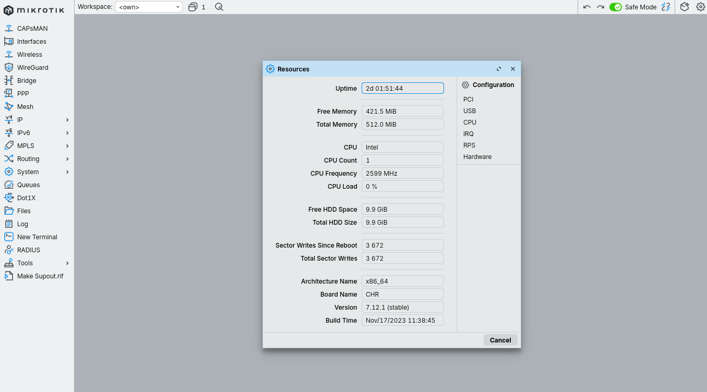

---

## Создаём скрипт `daily-backup`

WinBox: `System → Scripts` → `+`.

**Окно New Script:**
- Name: `daily-backup`
- Policy: оставляем все галочки (нужны минимум `read`, `write`, `policy`, `sensitive`, `ftp` - для бэкапа и записи файлов)
- Source: вставляем код ниже

```rsc
:local dt [/system clock get date]
:local id [/system identity get name]
:local fname ($id . "-" . $dt)

/export file=$fname
/system backup save name=$fname

:log info ("Backup created: " . $fname)
```

OK.

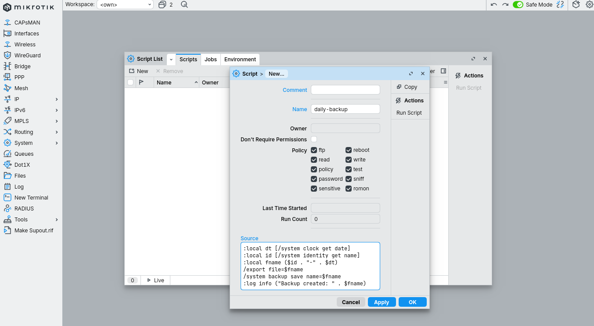

```
Разбор по строкам:

  :local dt [/system clock get date]
    Объявляем локальную переменную dt, кладём в неё текущую дату.
    Формат в RouterOS 7: "2026-06-14" (YYYY-MM-DD).

  :local id [/system identity get name]
    Локальная переменная id - имя роутера.
    У нас задано в лабе 1.1: "BR1-GW".

  :local fname ($id . "-" . $dt)
    Конкатенация: "BR1-GW" . "-" . "2026-06-14" = "BR1-GW-2026-06-14".
    Оператор "." в RouterOS - конкатенация строк.

  /export file=$fname
    Создаёт файл "BR1-GW-2026-06-14.rsc" в /Files.
    Расширение .rsc добавляется автоматически.
    Пароли в файл НЕ попадают (default RouterOS 7).

  /system backup save name=$fname
    Создаёт файл "BR1-GW-2026-06-14.backup" в /Files.
    Расширение .backup добавляется автоматически.
    Включает ВСЁ - пароли, ключи, сертификаты, файлы.

  :log info ("Backup created: " . $fname)
    Пишет сообщение в System -> Log с topic=info.
    Полезно при отладке и для мониторинга снаружи (через syslog).
```

---

## Ручной запуск для проверки

Перед тем как ставить на расписание - запускаем руками и убеждаемся что всё работает.

WinBox: `System → Scripts` → выделить `daily-backup` → кнопка **Run Script** сверху.

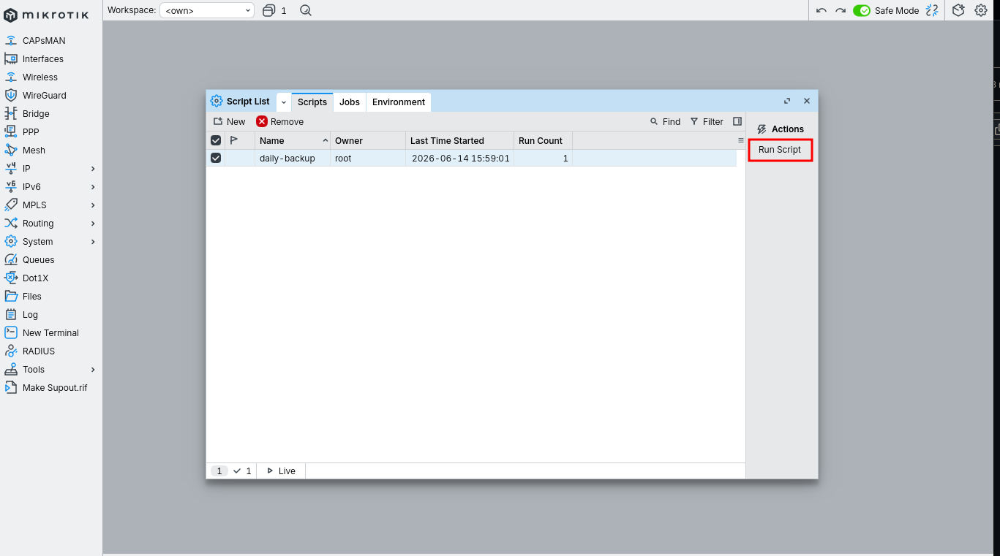

После запуска в окне Scripts видим:
- **Run Count: 1** (увеличился)
- **Last Time Started:** время запуска

Проверяем результат в `Files`:

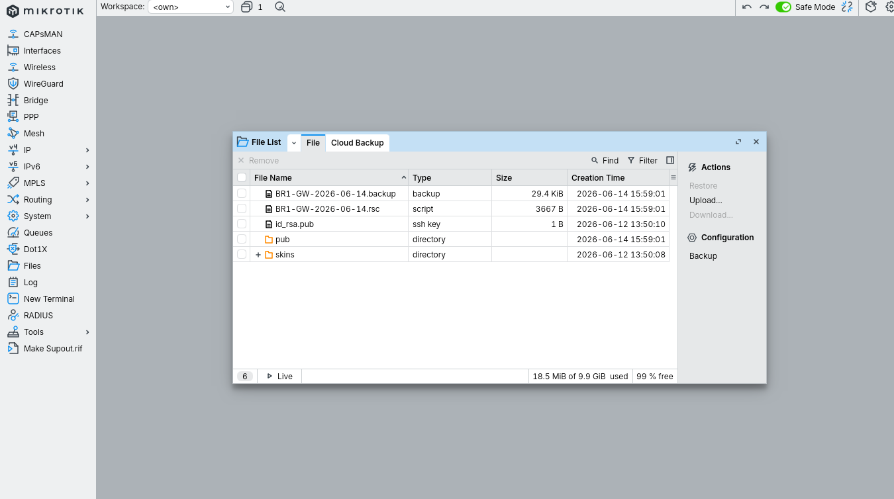

Должны увидеть два новых файла с одинаковой меткой времени:
- `BR1-GW-2026-06-14.backup` (~30 KiB)
- `BR1-GW-2026-06-14.rsc` (~3-4 KiB)

```
Что ещё может быть в Files:

  skins/     - папка для пользовательских тем WinBox
  pub/       - наша SMB-share папка (если включена)
  *.pub      - могут быть остатки от тестов SSH-ключей
               (например, пустой id_rsa.pub 1 байт - это норма,
                старая попытка, не мешает)

  В нашем случае позже там появится mtk_key.pub - загруженный
  публичный SSH-ключ для пользователя mn.
```

Проверяем что лог записался: `Log`.

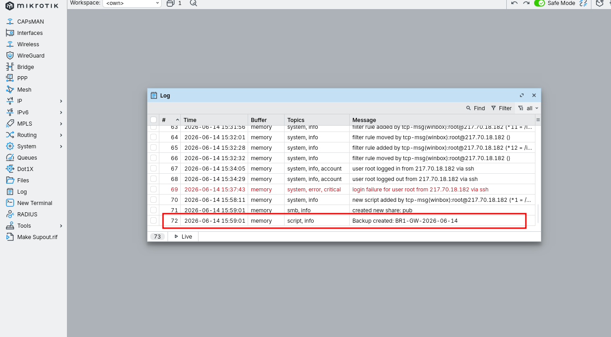

Видим строку `script,info Backup created: BR1-GW-2026-06-14`. Это значит `:log info` сработал, и снаружи через remote syslog мы сможем отслеживать успешность бэкапов.

---

## Создаём scheduler

WinBox: `System → Scheduler` → `+`.

**Окно New Scheduler:**
- Name: `daily-backup-job`
- Start Date: сегодняшняя (заполнится автоматически)
- Start Time: `03:00:00`
- Interval: `1d 00:00:00`
- Policy: те же что у скрипта (все галочки)
- On Event:
  ```
  /system script run daily-backup
  ```

OK.

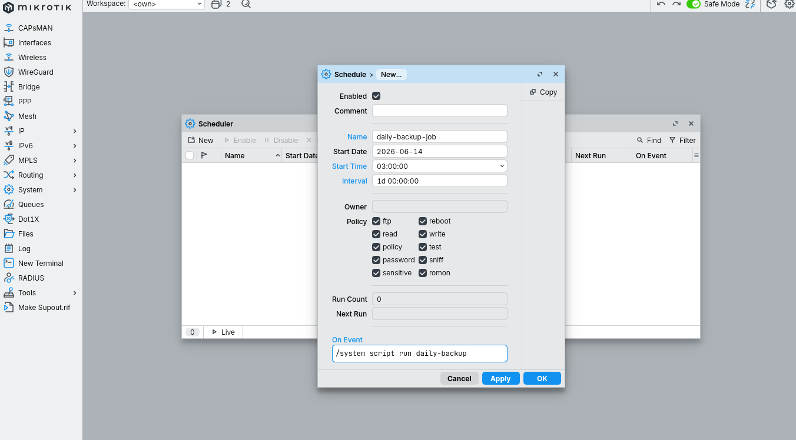

```
Параметры расписания:

  Start Date  - дата первого запуска (по умолчанию - сегодня)
  Start Time  - время первого запуска (03:00:00 - ночь, мало трафика)
  Interval    - период повторения
                "1d 00:00:00" = каждый день в одно и то же время
                "12h"          = дважды в сутки
                "7d"           = раз в неделю

  Логика первого запуска:
    Если Start Time сегодня ещё впереди - первый запуск в это время.
    Если уже прошло - первый запуск завтра в это же время.

  Часовой пояс важен: в лабе 1.1 мы выставили Europe/Moscow.
  03:00 = 03:00 по Москве. На CHR в чужом ДЦ это может быть
  не локальное время ДЦ - перепроверять не нужно, скрипт идёт
  по времени роутера.

  After event - событие после запуска (можно использовать для
  цепочек скриптов). У нас не нужно.
```

После создания в списке Scheduler видим:
- **Next Run:** завтра 03:00:00
- **Run Count:** 0 (автоматически ещё не запускалось)

Через CLI (`New Terminal`):
```
/system scheduler print
```

---

## Проверка содержимого .rsc

Скачиваем .rsc на компьютер и открываем в редакторе.

WinBox: `Files` → правый клик на `BR1-GW-2026-06-14.rsc` → **Download**.


В файле видим:

```
# 2026-06-14 15:59:01 by RouterOS 7.12.1
# software id =
#
#
/interface bridge add ...
/ip address add ...
/ip dhcp-client add ...
/ip firewall filter
add action=drop chain=input comment="ssh blacklisted" src-address-list=ssh-blacklist
add action=drop chain=input comment="winbox blacklisted" src-address-list=winbox-blacklist
add action=add-src-to-address-list address-list=ssh-blacklist address-list-timeout=1d ...
... и так далее
/user
add comment="" disabled=no group=full name=mn
```

Два важных проверочных момента:

1. **Все наши firewall-правила из лабы 1.3 на месте** - кэскад с stage1-3, blacklist, base chain. Если когда-то всё стёрлось - этот файл вернёт.

2. **В секции `/user` НЕТ строк `password=...`** - пароли действительно скрыты. Если видим открытый пароль - значит либо у нас RouterOS старше 7.x, либо где-то указали `show-sensitive=yes`. Файл уничтожить, скрипт пересохранить.

---

## Чистка старых бэкапов

Без чистки за год накопится 365 пар файлов на ~10 МБ. На CHR с 9.9 GiB диска - не проблема, но на железном RB c 16-64 МБ флешки забьётся за пару месяцев.

Добавляем чистку в наш скрипт. Расширенная версия:

```rsc
:local dt [/system clock get date]
:local id [/system identity get name]
:local fname ($id . "-" . $dt)

# Чистка: оставляем 14 самых свежих файлов с "backup" или ".rsc" в имени
:local count 0
:foreach i in=[/file find where (name~"backup" or name~"\\.rsc")] do={
    :set count ($count + 1)
    :if ($count > 14) do={
        /file remove $i
    }
}

/export file=$fname
/system backup save name=$fname

:log info ("Backup created: " . $fname)
```

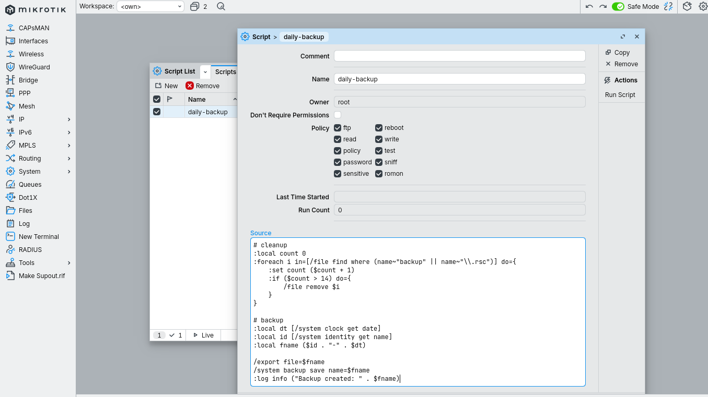

```
Что делает блок чистки:

  /file find where (name~"backup" or name~"\\.rsc")
    Находит все файлы, в имени которых есть "backup" ИЛИ ".rsc".
    Оператор "~" - regex match.
    Двойной \\ - экранирование точки (regex).

  :foreach i in=[...] do={ ... }
    Перебираем найденные файлы.
    Внутри $i - текущий файл.

  :set count ($count + 1)
    Инкрементируем счётчик.

  :if ($count > 14) do={ /file remove $i }
    Если уже видели 14 файлов - текущий удаляем.

Тонкость: порядок перебора file find не гарантирован.
Если хотим именно "оставить 14 новейших, удалить остальные" -
нужно сортировать по creation-time. В нашей версии чистка
работает по принципу "сократим до 14 чего угодно подходящего".

Для VPS с 10 ГБ это допустимо. Для жёстких production-условий
лучше сортировать и удалять явно старые - но это усложнение
не вписывается в формат базовой лабы.
```

Альтернатива - оставить скрипт без чистки и держать только последние N файлов через bash-скрипт на Linux-сервере (см. ниже).

---

## SSH-ключ для пользователя `mn` (подготовка к фетчу)

Будущий bash-скрипт на Linux-сервере будет ходить на роутер по SSH без пароля - значит нужен SSH-ключ. Делаем его сейчас, пока в лабе, и сразу проверяем что работает.

На Linux-сервере (Debian, Ubuntu, любой):

```bash
ssh-keygen -t ed25519 -f ~/.ssh/mtk_key -N ""
```

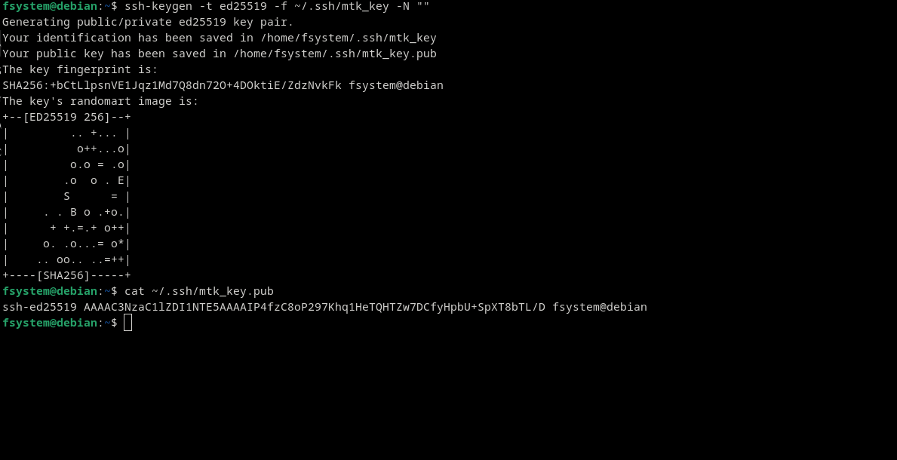

```
Параметры:
  -t ed25519  - тип ключа Ed25519, современный и быстрый.
                Альтернативы: rsa (старый, длиннее), ecdsa (компромисс).
                Для MikroTik работают все три.

  -f ~/.ssh/mtk_key
                Путь к файлу. Создаст:
                  mtk_key      - приватный ключ (НИКОМУ)
                  mtk_key.pub  - публичный ключ (на роутер)

  -N ""       - пустой passphrase. Для cron-скрипта обязательно
                (cron не может ввести пароль ключа интерактивно).

                Если бы использовали ключ для интерактивной работы -
                ставили бы пароль и грузили через ssh-agent.
```

После генерации содержимое `mtk_key.pub` - одна длинная строка вида:
```
ssh-ed25519 AAAAC3NzaC1lZDI1NTE5AAAAIP4fzC8oP297Khq1HeTQHTZw7DCfyHpbU+SpXT8bTL/D fsystem@debian
```

### Загрузка ключа на роутер

Самый простой способ - drag-and-drop файла `mtk_key.pub` в окно `Files` WinBox.

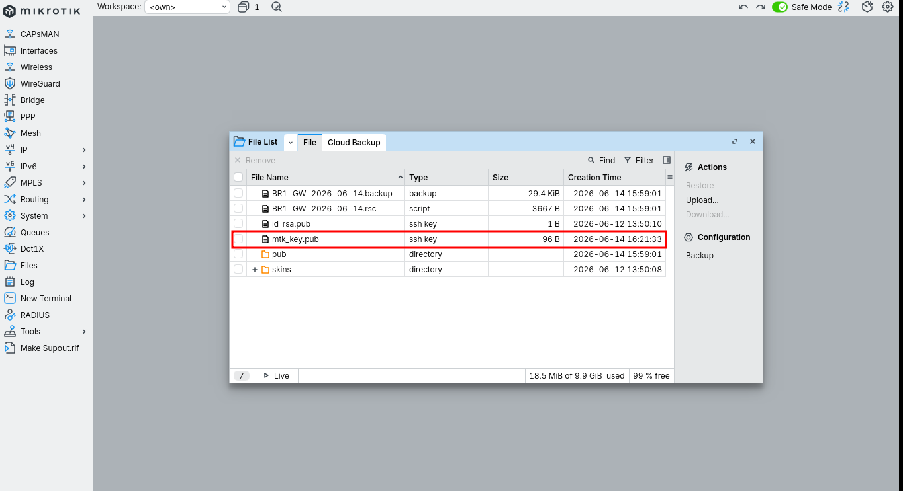

### Привязка ключа к пользователю `mn`

WinBox: `System → Users` → вкладка **SSH Keys** → кнопка **Import SSH Key**.

В появившемся окне:
- User: `mn`
- Key file: `mtk_key.pub`

Import.

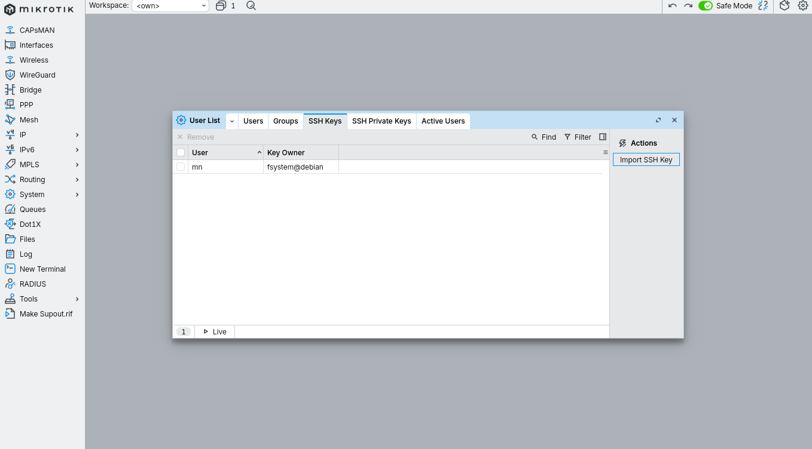

После импорта в списке появляется запись с владельцем ключа (`fsystem@debian` в нашем случае - имя хоста где ключ сгенерирован).

### Проверка с Linux-сервера

```bash
ssh -p 22022 -i ~/.ssh/mtk_key mn@<router-IP>
```

Если всё правильно - входим без запроса пароля, видим стандартный MikroTik MOTD.

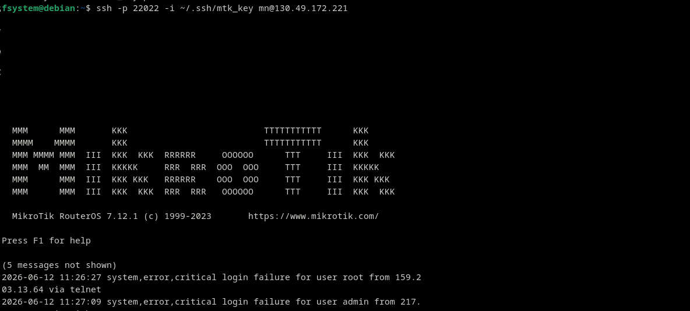

```
Интересное наблюдение в MOTD:

  При входе MikroTik показывает "(N messages not shown)" и
  последние записи аутентификации, например:
  
    2026-06-12 11:26:27 login failure for user root from 159.X via telnet
    2026-06-12 11:27:09 login failure for user admin from 217.X
  
  Это значит:
  
  1. Сканеры с интернета постоянно пытаются войти под "root" и "admin"
     (дефолтные имена). Hardening из лабы 1.1 (мы отключили admin
     и не создавали root) работает - все попытки failure.
  
  2. Telnet-попытки видим хотя сервис отключён в лабе 1.1 -
     это попытки подключения, которые отбиваются на уровне
     RouterOS до факта аутентификации (закрытый порт),
     но MOTD всё равно показывает их.
  
  3. Это нормальный фон публичного IP. Беспокоиться нужно только
     если видим "login success" с непонятного адреса.
```

---

## Часть 2: забор бэкапов на внешний сервер (план)

Локальные бэкапы на роутере хороши, но если роутер физически сгорит - они сгорят вместе с ним. Нужен фетч на отдельный сервер. В нашей текущей инфраструктуре (один CHR на VPS) такого сервера ещё нет, поэтому ниже - план для следующего шага, когда появится Linux bastion.

### bash-скрипт на Linux-сервере

```bash
#!/bin/bash
# /opt/scripts/fetch-mtk-backups.sh

declare -A ROUTERS=(
    ["BR1-GW"]="130.49.172.221"
    # добавим больше когда появятся: ["BR2-GW"]="..."
)

DEST=/opt/mtk-backups
SSH_PORT=22022
SSH_USER="mn"
SSH_KEY="$HOME/.ssh/mtk_key"

mkdir -p "$DEST"

for name in "${!ROUTERS[@]}"; do
    ip="${ROUTERS[$name]}"
    echo "Fetching from $name ($ip)..."
    mkdir -p "$DEST/$name"
    
    rsync -av -e "ssh -p $SSH_PORT -i $SSH_KEY -o StrictHostKeyChecking=accept-new" \
        "${SSH_USER}@${ip}:*.rsc" \
        "${SSH_USER}@${ip}:*.backup" \
        "$DEST/$name/" 2>/dev/null || echo "  failed for $name"
done

if [ -d "$DEST/.git" ]; then
    cd "$DEST" || exit 1
    git add .
    if ! git diff --staged --quiet; then
        git commit -m "auto-backup $(date +%F-%H%M)"
        git push origin main 2>/dev/null || echo "git push failed"
    fi
fi
```

```
Отличия от классического "одного scp":

  rsync вместо scp
    rsync не качает то что уже скачано (по контрольной сумме).
    На повторных запусках почти ничего не передаёт.

  StrictHostKeyChecking=accept-new
    При первом подключении автоматически принимает host key.
    Для cron-скрипта нужно - интерактивное "Are you sure?"
    его сломает.

  mn вместо admin
    admin у нас отключён в лабе 1.1.

  Раскладка по подпапкам $DEST/$name/
    Если роутеров несколько - каждый в свою папку.

  git add/commit/push с проверкой diff
    Не коммитим если изменений нет (иначе будет много пустых
    коммитов "ничего не поменялось").
```

### cron на Linux-сервере

```
# /etc/cron.d/mtk-backup
30 3 * * * root /opt/scripts/fetch-mtk-backups.sh >> /var/log/mtk-backup.log 2>&1
```

Запускаем в 03:30 - через 30 минут после того как роутер сделал бэкап локально (03:00).

### Где хранить .backup файлы

`.rsc` - текст без паролей - можно в git, даже в публичный если разделять с условием.

`.backup` - бинарь с хешами паролей, ключами, сертификатами - в публичный git **нельзя**. Варианты:

1. Отдельный приватный git с шифрованием на клиенте (git-crypt, age)
2. Зашифрованный том (LUKS) на сервере, .backup только туда
3. Просто не хранить далеко - 14 свежих на роутере + 30 свежих на сервере хватит для всех практических задач, древние .backup всё равно не пригодятся (RouterOS за год успевает обновиться, восстановление 2-летнего бэкапа на новой версии может не сработать)

---

## Восстановление (must-know сценарий)

Бэкапы бесполезны если не понимаем как из них восстанавливаться.

**Полное восстановление из .backup:**

WinBox: `Files` → drag-and-drop `BR1-GW-2026-06-14.backup` в окно Files.

Затем через CLI:
```
/system backup load name=BR1-GW-2026-06-14
```

Роутер перезагрузится с восстановленной конфигурацией. Все настройки, пользователи, ключи - точно как были на момент бэкапа.

!!! Это перетрёт ВСЁ текущее. Применяется когда роутер чистый (новый, после reset) или конфиг полностью сломан.

**Восстановление из .rsc (полное):**

```
/import file-name=BR1-GW-2026-06-14.rsc
```

!!! `import` не очищает существующий конфиг - просто выполняет команды из файла поверх. Если есть конфликты (например, IP уже занят) - часть строк не применится с ошибкой.

Для чистого восстановления из .rsc сначала делаем `/system reset-configuration no-defaults=yes`, потом `/import`.

**Частичное восстановление из .rsc:**

Открываем .rsc в редакторе, копируем нужную секцию (например, только `/ip firewall filter`), вставляем в `New Terminal` на роутере. Применится поверх.

Очень удобно для "восстановить ТОЛЬКО firewall после того как я случайно его стёр".

```
Сравнение:
  .backup  - "всё точно как было" (после железной замены)
  .rsc     - "видеть в git что менялось" + "восстановить кусок"
  
  Поэтому делаем оба - они занимают мало места, дают разные сценарии.
```

---

## Грабли

```
1. Использовали старый синтаксис hide-sensitive в RouterOS 7.
   -> Ошибка "no such argument", скрипт падает.
   Лекарство: на 7.x просто /export file=name (без флагов).
   На 6.x - /export hide-sensitive file=name.

2. Скрипт перезаписывает файл с тем же именем в один день.
   -> Если запустить дважды за сутки - старая копия теряется.
   В большинстве случаев это норма (зачем нам две копии за один день),
   но если делаем тестовый запуск в день когда уже был бэкап -
   потеряем утренний.
   Лекарство: добавить время в имя файла:
     :local fname ($id . "-" . $dt . "-" . [/system clock get time])

3. Scheduler не запускается в назначенное время.
   -> Чаще всего: неправильный часовой пояс (System -> Clock).
   Лекарство: проверить timezone, проверить /system clock print что
   время правильное, проверить что NTP синхронизирован
   (status=synchronized в /system ntp client).

4. Скрипт работает руками, но не работает по scheduler.
   -> У scheduler политики могут быть строже чем у скрипта.
   На действие /system backup save нужно policy=sensitive,
   на /file remove - policy=write.
   Лекарство: ставим scheduler те же policy что у скрипта
   (или все галочки на всякий случай).

5. .rsc оказался с паролями в открытом виде.
   -> Версия RouterOS < 7.0 (где hide-sensitive надо явно), или
   мы указали show-sensitive=yes.
   Лекарство: проверить /system resource print, обновить скрипт,
   уничтожить старые .rsc которые попали в git, перегенерировать
   все пароли которые могли утечь.

6. SSH-ключ работает, но cron-скрипт всё равно падает с "permission denied".
   -> StrictHostKeyChecking стопорит первый запуск.
   Лекарство: добавить -o StrictHostKeyChecking=accept-new
   или вручную один раз ssh-нуться чтобы host key попал в known_hosts.

7. Бэкапы накопились, забили флешку.
   -> Скрипт продолжает работать, но новые файлы не записываются.
   В Log будут ошибки disk full.
   Лекарство: чистка в скрипте (наш foreach с count > 14) или
   уменьшить интервал хранения, или фетчить чаще и удалять.

8. Загрузили SSH-ключ, но при логине всё равно спрашивает пароль.
   -> Чаще всего: на сервере права на ~/.ssh/mtk_key не 600
   (ssh не использует ключ с слишком открытыми правами).
   Лекарство: chmod 600 ~/.ssh/mtk_key. Также проверить что
   на роутере ключ привязан именно к пользователю mn
   (System -> Users -> SSH Keys, видим строку с User=mn).

9. Восстановили из .backup, а версия RouterOS оказалась младше.
   -> Бэкап от 7.12.1 не загрузится на 7.6 (например).
   Лекарство: всегда хранить .backup вместе с информацией о версии,
   и при возможности - обновлять RouterOS перед восстановлением.

10. Закоммитили .backup в публичный репозиторий.
    -> Хеши паролей в открытом доступе. Bcrypt можно брутить.
    Лекарство: немедленно убрать (force-push с очисткой истории!),
    сменить ВСЕ пароли на роутерах, отозвать сертификаты.
    Профилактика: .gitignore с *.backup сразу в начале проекта.
```

---


- **Bash-скрипт + cron на Linux-сервере** - реальный забор файлов с роутера. Делаем когда появится bastion-сервер в инфраструктуре.
- **Удалённое хранилище через scheduler** - RouterOS умеет `/tool fetch upload=yes` на FTP/SFTP/HTTP. Тогда фетч инициирует сам роутер, без необходимости в Linux-сервере. Тема для лабы 1.5.
- **Шифрование .backup** - `/system backup save encryption=aes-sha256 password=…`. Полезно если бэкап летит через незащищённый канал. Минус - нужно хранить ключ шифрования отдельно.
- **Уведомления о статусе** - в скрипт добавить отправку в Telegram/email через `/tool fetch` или `/tool e-mail send`. Тогда узнаём когда бэкап не сделался.
- **Версионирование RouterOS** - в скрипт класть и текущий .npk пакет (`/file print` -> копия установленного образа). Позволяет восстановиться на ту же версию даже если её уже сняли с сайта.
- **Конфигурация в Git с code review** - не "автоматический коммит после фетча", а pull request на изменения конфига перед применением на роутер. Это уже DevOps, тема для отдельного раздела.
- **Off-site хранение** - копия бэкапов в облако (S3, B2, Google Drive) на случай если умрёт сразу и роутер и Linux-сервер.
